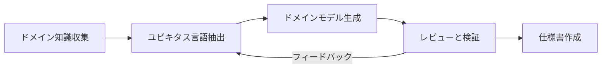

## 概要
このガイドは、Claude Codeのカスタムコマンドとサブエージェントを活用して、チームでDDD（ドメイン駆動設計）ベースの設計資料を作成するためのワークフローを説明します。

## 前提条件
- Claude Codeがインストールされていること
- プロジェクトのルートディレクトリに`.claude/`ディレクトリが設定されていること
- langextractツールへのアクセス: `/Users/bruwbird/projects/github.com/google/langextract`

## ワークフローの全体像



## フェーズ別ガイド

### フェーズ1: 知識の蒸留とユビキタス言語の抽出（1-2日）

#### 1.1 準備
- 議事録、要件定義書、既存ドキュメントを収集
- ステークホルダーインタビューの実施
- イベントストーミングセッションの開催

#### 1.2 ユビキタス言語の抽出
```bash
# 議事録からユビキタス言語を抽出
/ddd-extract-ul meeting-notes.md

# 複数のドキュメントがある場合
/ddd-extract-ul requirements/*.md
```

#### 1.3 成果物の確認
- `domain/ubiquitous-language.md`: 用語集とビジネスルール
- `domain/ul-analysis.md`: 分析過程の記録

#### 1.4 チームレビュー
- 用語の定義をステークホルダーと確認
- 不明瞭な点や矛盾の解消
- 追加の用語や概念の発見

### フェーズ2: ドメインモデルの生成（2-3日）

#### 2.1 初期モデルの生成
```bash
# ユビキタス言語からドメインモデルを生成
/ddd-model domain/ubiquitous-language.md
```

#### 2.2 モデルの詳細化
サブエージェントが自動的に以下を実行：
- 集約境界の最適化
- エンティティ/値オブジェクトの設計
- ドメインイベントの定義
- PlantUML図の生成

#### 2.3 成果物の構成
```
domain/model/
├── aggregates/      # 集約の定義
├── events/          # ドメインイベント
├── commands/        # コマンド定義
├── diagrams/        # UML図
└── samples/         # 実装サンプル
```

### フェーズ3: レビューと検証（1-2日）

#### 3.1 レビューの実施
```bash
# モデルのレビュー資料を生成
/ddd-review domain/model/
```

#### 3.2 ステークホルダーレビュー
- ビジネス要件との適合性確認
- 用語や概念の妥当性検証
- 将来の拡張性の確認

#### 3.3 技術レビュー
- アーキテクチャとの整合性
- 実装可能性の検証
- パフォーマンスへの影響評価

### フェーズ4: 仕様書の作成（1日）

#### 4.1 実装仕様書の生成
```bash
# レビュー済みモデルから仕様書を生成
/ddd-spec domain/model/
```

#### 4.2 成果物
- API仕様（OpenAPI形式）
- データモデル設計
- 実装ガイドライン
- 非機能要件

## カスタムコマンド一覧

| コマンド          | 説明                 | 使用例                       |
| ----------------- | -------------------- | ---------------------------- |
| `/ddd-extract-ul` | ユビキタス言語を抽出 | `/ddd-extract-ul meeting.md` |
| `/ddd-model`      | ドメインモデルを生成 | `/ddd-model domain/ul.md`    |
| `/ddd-review`     | モデルをレビュー     | `/ddd-review domain/model/`  |
| `/ddd-spec`       | 仕様書を生成         | `/ddd-spec domain/model/`    |

## サブエージェントの役割

### ddd-analyst
- ドメイン文書の詳細分析
- ユビキタス言語の抽出と整理
- ビジネスルールの発見

### ddd-modeler
- DDDパターンに基づくモデル設計
- 実装サンプルの生成
- PlantUML図の作成

### ddd-reviewer
- モデルの品質検証
- フィードバックの収集と整理
- 改善提案の生成

## ベストプラクティス

### 1. 反復的なアプローチ
- 完璧を求めず、小さく始める
- フィードバックを頻繁に取り入れる
- 継続的な改善を心がける

### 2. コミュニケーション重視
- ステークホルダーとの定期的な対話
- 視覚的な資料（UML図）の活用
- 具体例による説明

### 3. 技術と業務のバランス
- ビジネス価値を最優先
- 技術的制約の早期把握
- 段階的な移行計画

## トラブルシューティング

### よくある問題と対処法

#### 1. コマンドが認識されない
```bash
# .claudeディレクトリの確認
ls -la .claude/commands/ddd/

# コマンドファイルの権限確認
chmod +r .claude/commands/ddd/*.md
```

#### 2. サブエージェントが動作しない
```bash
# サブエージェント設定の確認
cat .claude/subagents/ddd-*.md

# YAMLフロントマターの検証
```

#### 3. 生成結果が期待と異なる
- 入力ドキュメントの品質確認
- ユビキタス言語の明確性
- プロンプトのカスタマイズ

## 継続的改善

### メトリクスの収集
- モデル生成にかかった時間
- レビューで発見された問題数
- 実装時の変更要求数

### レトロスペクティブ
- 各フェーズ終了時の振り返り
- プロセスの改善点の特定
- ツールやコマンドの最適化

### ナレッジの蓄積
- 成功パターンの文書化
- アンチパターンの共有
- チーム固有のカスタマイズ

## 関連リソース

- [Domain-Driven Design (Eric Evans)](https://www.amazon.com/Domain-Driven-Design-Tackling-Complexity-Software/dp/0321125215)
- [Implementing Domain-Driven Design (Vaughn Vernon)](https://www.amazon.com/Implementing-Domain-Driven-Design-Vaughn-Vernon/dp/0321834577)
- [Event Storming](https://www.eventstorming.com/)
- [PlantUML Documentation](https://plantuml.com/)

## サポート

問題や質問がある場合は、以下の方法でサポートを受けられます：

1. プロジェクト内のドキュメント確認
2. チームのDDDエキスパートへの相談
3. Claude Codeの`/help`コマンドの使用