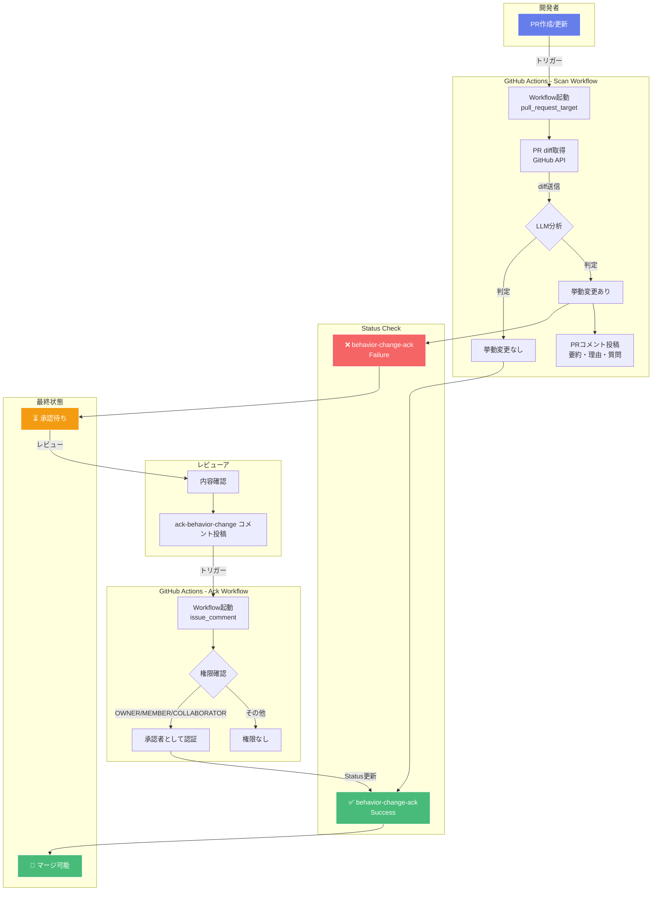
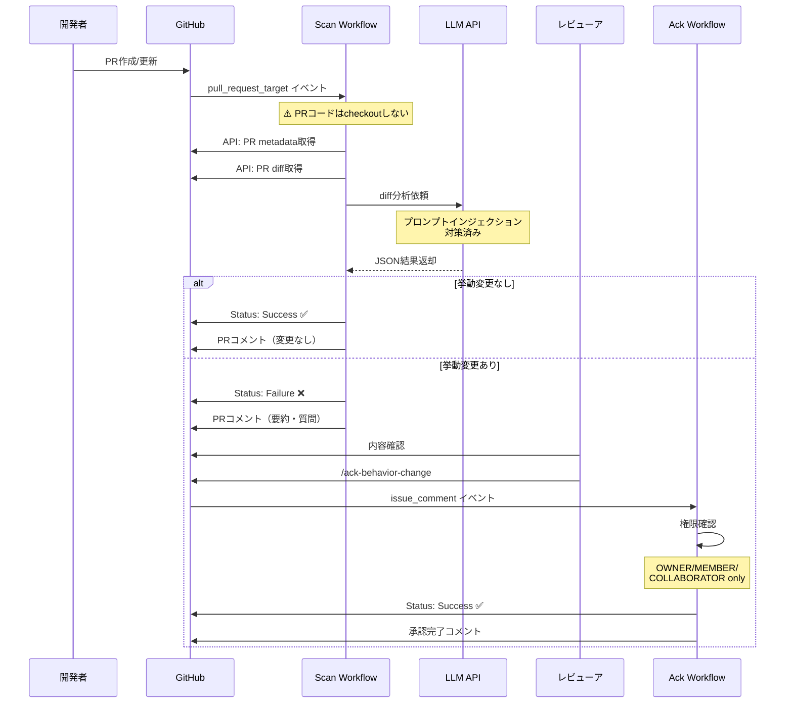
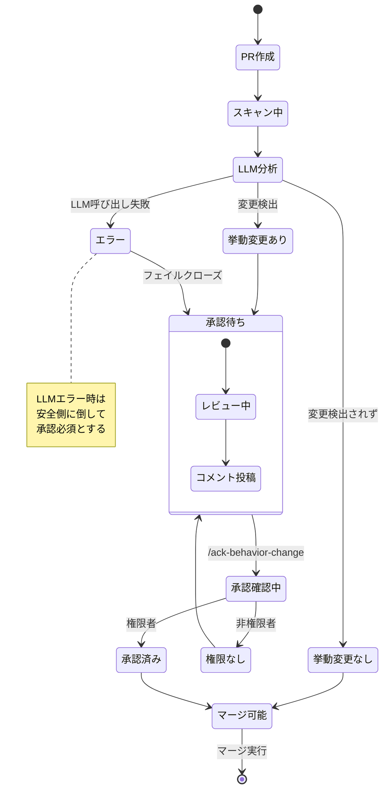

**qodo‑ai/pr-agent（PR‑Agent）を使って「挙動変更」ラベルを自動付与し、その変更を**人間が `/ack-behavior-change` で承認したときだけマージ可能**にする最小構成**を示します。
仕組みは次の 4 点です。

1. PR-Agent の `/describe` を自動実行し、**カスタムラベル（挙動変更）を自動判定して PR に発行**（publish）
2. 「挙動変更」ラベルが付いた PR では **必須ステータス `behavior-change-ack` を failure** にする（承認待ち）
3. 権限者が PR コメントで **`/ack-behavior-change`** と書くと **`behavior-change-ack` を success** にする
4. ブランチ保護で **`behavior-change-ack` を Required** に設定（これが success でないとマージ不可）

> 参考：PR‑Agent の自動ラベル生成（`/generate_labels` および `/describe` からの利用）、`publish_labels` 設定、GitHub Action の基本セットアップは公式ドキュメントを根拠にしています。([Qodo Merge][1])
> 補足：GitHub の API で PR にラベルを付ける場合、その**ラベル自体はリポジトリに存在している必要**があります（先に作成します）。([GitHub Docs][2])


## 🔄 全体フロー図



## 🔐 セキュリティフロー



## 📊 状態遷移図



---

## 0) 事前準備：リポジトリにラベルを作成

リポジトリ → **Settings → Labels → New label** で次を作成：

* **Name**: `挙動変更`
* **Description**:
  `pr_agent: この PR が外部から観測可能な挙動（API/CLI/HTTP ルート/返り値/設定デフォルト/DB スキーマ/認証認可/タイミングで結果が変わる等）を変更する場合に付与する。コメント/ドキュメント/純粋なリファクタのみは除外。`

> PR‑Agent のオープンソース版では、**検知のための定義は .pr\_agent.toml に書く**のが公式手順ですが、GitHub にラベルそのものも用意しておく必要があります。([Qodo Merge][1])

---

## 1) PR-Agent（ラベル発行つき `/describe` 自動実行）

`.github/workflows/pr-agent.yml` を追加：

```yaml
name: PR Agent
on:
  pull_request:
    types: [opened, reopened, ready_for_review, synchronize]
  issue_comment:
    types: [created]

permissions:
  contents: write
  issues: write
  pull-requests: write

jobs:
  pr_agent_job:
    if: ${{ github.event.sender.type != 'Bot' }}
    runs-on: ubuntu-latest
    steps:
      - name: Run PR-Agent
        uses: qodo-ai/pr-agent@main
        env:
          GITHUB_TOKEN: ${{ secrets.GITHUB_TOKEN }}
          OPENAI_KEY:   ${{ secrets.OPENAI_KEY }}
          # 自動で /describe を実行し、ラベルを PR に publish
          github_action_config.auto_describe: "true"
          pr_description.publish_labels: "true"
```

> GitHub Action の導入・`publish_labels=true`・`/describe` 自動実行の方法は公式のガイドに準拠しています。([Qodo Merge][3])

### `.pr_agent.toml`（挙動変更の定義）

リポジトリ直下に配置：

```toml
[config]
enable_custom_labels = true

# Action で auto_describe を使うため、ここではコマンド指定は不要
# （GitHub App 方式の場合は [github_app].pr_commands に "/describe" を列挙）

[pr_description]
# 念のためファイル側でも明示しておけます（環境変数が優先）
publish_labels = true

[custom_labels."挙動変更"]
description = """
Add this label if the PR introduces externally observable behavior changes for end users, public APIs, CLI/HTTP routes or return codes, configuration defaults, database schema/migrations, authentication/authorization scopes/permissions, or timing/concurrency that changes outputs.
Examples: API signature changes; default value changes; new/modified endpoints; backward-incompatible CLI flags; DB schema migration altering columns/indexes; permission scope changes.
Exclude: docs/comments only, tests only, or refactors that do not change externally visible behavior.
"""
```

> カスタムラベルの有効化と定義方法（`.pr_agent.toml`／`enable_custom_labels`／`custom_labels`）および `/describe` がラベルも生成・発行する仕様は公式ドキュメントに基づいています。([Qodo Merge][1])

---

## 2) マージガード（ラベルがあれば failure、承認で success）

### `.github/workflows/behavior-gate.yml`

```yaml
name: Behavior-Change Gate
on:
  pull_request_target:
    types: [opened, reopened, synchronize, labeled, unlabeled, edited]

permissions:
  contents: read
  pull-requests: read
  statuses: write

concurrency:
  group: pr-${{ github.event.pull_request.number }}-behavior-gate
  cancel-in-progress: true

jobs:
  gate:
    runs-on: ubuntu-latest
    steps:
      - name: Set required status from labels
        uses: actions/github-script@v7
        with:
          script: |
            const owner = context.repo.owner;
            const repo = context.repo.repo;
            const prNum = context.payload.pull_request.number;
            const pr = await github.rest.pulls.get({owner, repo, pull_number: prNum});
            const sha = pr.data.head.sha;
            const labels = pr.data.labels.map(l => l.name);
            const hasBehavior = labels.includes("挙動変更");

            // 既存の commit status を確認（同一 context の success があれば維持）
            const { data: statuses } =
              await github.rest.repos.listCommitStatusesForRef({owner, repo, ref: sha});
            const hasAck =
              statuses.some(s => s.context === "behavior-change-ack" && s.state === "success");

            if (hasBehavior && !hasAck) {
              await github.rest.repos.createCommitStatus({
                owner, repo, sha,
                state: "failure",
                context: "behavior-change-ack",
                description: "挙動変更ラベルあり。/ack-behavior-change による承認待ち"
              });
            } else if (!hasBehavior) {
              await github.rest.repos.createCommitStatus({
                owner, repo, sha,
                state: "success",
                context: "behavior-change-ack",
                description: "挙動変更ラベルなし（承認不要）"
              });
            } else {
              await github.rest.repos.createCommitStatus({
                owner, repo, sha,
                state: "success",
                context: "behavior-change-ack",
                description: "承認済み"
              });
            }
```

* **意図**：挙動変更ラベルが**ある** → `behavior-change-ack` を **failure**（承認待ち）
  承認済み success が既に当該コミット SHA にある場合は success を維持
  ラベルが**ない** → success（承認不要）
* `pull_request_target` を使うのは、fork PR でも**ステータス更新が必要**なためです（PR のコードは checkout しません）。

---

## 3) 承認コマンド（`/ack-behavior-change`）

### `.github/workflows/behavior-ack.yml`

```yaml
name: Behavior-Change Acknowledge

on:
  issue_comment:
    types: [created]

permissions:
  statuses: write
  pull-requests: read
  issues: write

jobs:
  ack:
    if: github.event.issue.pull_request != null
    runs-on: ubuntu-latest
    steps:
      - name: Acknowledge if authorized and command matches
        uses: actions/github-script@v7
        with:
          script: |
            const body = (context.payload.comment.body || "").trim();
            const assoc = context.payload.comment.author_association;
            const owner = context.repo.owner;
            const repo = context.repo.repo;
            const prNumber = context.payload.issue.number;

            if (!/^\/ack-behavior-change(\b|$)/i.test(body)) {
              core.info("No ack command. Skipping.");
              return;
            }
            if (!["OWNER","MEMBER","COLLABORATOR"].includes(assoc)) {
              core.setFailed(`権限不足: ${assoc}`);
              return;
            }

            const { data: pr } =
              await github.rest.pulls.get({owner, repo, pull_number: prNumber});
            const sha = pr.head.sha;

            await github.rest.repos.createCommitStatus({
              owner, repo, sha,
              state: "success",
              context: "behavior-change-ack",
              description: `承認済み by @${context.payload.comment.user.login}`
            });

            await github.rest.reactions.createForIssueComment({
              owner, repo, comment_id: context.payload.comment.id, content: "+1"
            });
            await github.rest.issues.createComment({
              owner, repo, issue_number: prNumber,
              body: `✅ 挙動変更の承認を受け付けました（@${context.payload.comment.user.login}）。`
            });
```

* **承認はコミット SHA 単位**です。新しいコミットが push される（`synchronize`）と Gate が再評価し、再び failure に戻ります（再承認が必要）。

---

## 4) ブランチ保護の設定

対象ブランチの **Branch protection** で **Required status checks** に
**`behavior-change-ack`** を追加してください。
これにより **承認が付くまでマージ不可**になります。

---

## 5) 動作の流れ

1. PR 作成/更新 → PR-Agent が `/describe` を自動実行し、**カスタムラベル判定＋ラベルを PR に publish**。([Qodo Merge][4])
2. Gate がラベルを見て、**挙動変更あり → failure** / **なし → success** に設定。
3. レビューア（OWNER/MEMBER/COLLABORATOR）が **`/ack-behavior-change`** とコメント → **success** に更新。
4. Required チェックがそろえばマージ可能。
5. 追加コミットが入ると Gate が再評価し、**承認はリセット**（その SHA で再承認）。

---

## 6) すぐに試せるセットアップ手順（まとめ）

1. **ラベル作成**（`挙動変更`）
2. **Secrets** に `OPENAI_KEY` を登録（OpenAI/互換 API など）。([Qodo Merge][3])
3. 上記 3 つの Workflow と `.pr_agent.toml` をコミット
4. ブランチ保護で **`behavior-change-ack` を Required** に設定
5. PR を開いて動作確認：

   * 変更に応じて PR に **挙動変更** ラベルが付く（または付かない）
   * ラベルありのときは **failure** → `/ack-behavior-change` で **success** へ

---

## 7) チューニングのポイント

* **誤検知/漏れ**があれば、`.pr_agent.toml` の **`[custom_labels."挙動変更"].description`** を具体化（対象/除外の例を増やす）。([Qodo Merge][1])
* `/generate_labels` を手動で試すこともできます（動作は `/describe` と共通のカスタムラベル定義を利用）。([Qodo Merge][1])
* ラベル publish は `/describe` の `publish_labels` が **true** であることを確認。([Qodo Merge][4])
* 外部コントリビュータ（fork 由来）まで自動化したい場合は、GitHub App 版やホスト版（Qodo Merge）の検討も（セットアップが簡単）。([Qodo Merge][3])

---

必要なら、ラベル名やコマンド名（例：`/ack-bc` など）・権限判定（CODEOWNERS 準拠）・CI の通知先（Slack 等）に合わせて微調整版もお出しします。

[1]: https://qodo-merge-docs.qodo.ai/tools/custom_labels/ " Generate Labels - Qodo Merge (and open-source PR-Agent)"
[2]: https://docs.github.com/en/actions/tutorials/manage-your-work/add-labels-to-issues?utm_source=chatgpt.com "Adding labels to issues - GitHub Docs"
[3]: https://qodo-merge-docs.qodo.ai/installation/github/ "Github - Qodo Merge (and open-source PR-Agent)"
[4]: https://qodo-merge-docs.qodo.ai/tools/describe/ "Describe - Qodo Merge (and open-source PR-Agent)"
