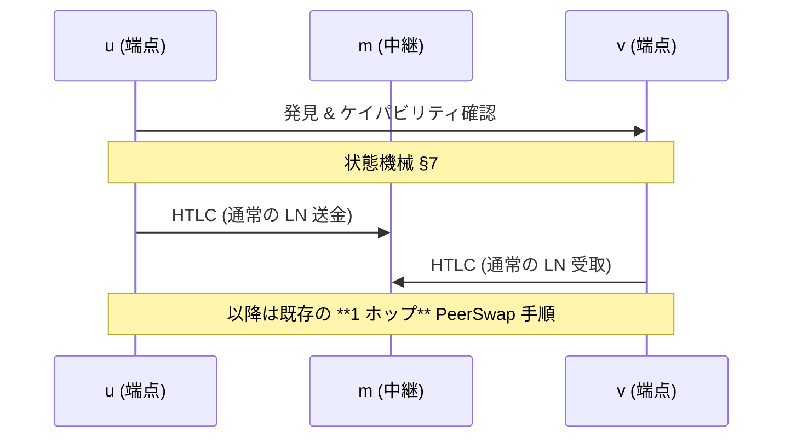
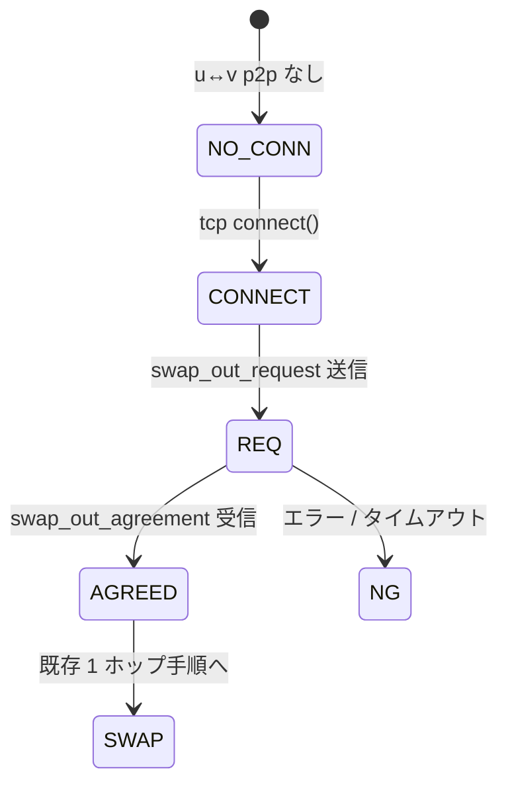

2hop peerswapの提案のdraft。

## 1. 動機

PeerSwapは **直結（1 ホップ）** の 2 ノード間でオンチェーン資産を
アトミックに交換できる。  
実ネットワークには「間に 1 ノードだけ挟まる 2 ホップ経路」
`u → m → v` が多数存在するため，ここでもスワップを可能にしたい。

* 追加チャネルを開かずに流動性を解放  
* 中継ノード *m* の協力や信頼は一切不要  
* 既存の 1 ホップ・プロトコルを端点 u・v ではそのまま利用

本提案では追加メッセージと状態機械を最小限に抑え，
後方互換性を保った **intermediary-agnostic** な拡張を示す。

---

## 2. ネットワークモデル

```text
u──ch₁──m──ch₂──v
 ↕  p2p (tcp) ↕
```

* `ch₁`, `ch₂` は通常の公開 LN チャネル  
* **u**, **v** は `lncli connect` 等で p2p 接続し，
  カスタムメッセージ (BOLT-1) を送受信できる  
* 中継 *m* が PeerSwap 対応かどうかは問わない

---

## 3. 全体フロー



新たに必要なのは **発見** と **交渉** の 2 メッセージだけ。

---

## 4. ワイヤメッセージ  
*(すべて奇数 type → 旧ノードは無視)*

<details>
<summary><code>swap_out_request (type = 54810)</code></summary>

```tlv
tlv_stream SwapOutRequest
{
    [1]  : u64   version          ; 現状 1
    [3]  : bytes swap_id          ; 16–32 B ランダム
    [5]  : bytes asset            ; "BTC" / "LBTC" …
    [7]  : bytes network          ; "mainnet" / "signet" …
    [9]  : u64   scid             ; ch₁ の short_channel_id
    [11] : u64   spendable        ; u→m 送金可能額 (msat)
    [13] : bytes intermediary_key ; m の pubkey (33 B)
    [15] : bytes pubkey           ; u の pubkey (33 B)
}
```
</details>

<details>
<summary><code>swap_out_agreement (type = 54811)</code></summary>

```tlv
tlv_stream SwapOutAgreement
{
    [1] : u64  version
    [3] : bytes swap_id     ; エコー
    [5] : u64  amount_msat  ; min(spendable, receivable)
    [7] : u64  receivable   ; v←m 受取可能額 (msat)
    [9] : bytes error       ; 非空なら拒否理由
}
```
</details>

1 往復で十分。以降は元の 1 ホップ状態機械へ合流。

---

## 5. 金額計算

```
amount_msat = min( spendable(u→m), receivable(v←m) )
```

*m* のプライバシーは守られる；端点は自身の `listchannels` だけを参照。

---

## 6. ピア発見戦略

| 戦略                                                                 | *m* が PeerSwap 必須? | 長所         | 短所                   |
| -------------------------------------------------------------------- | --------------------- | ------------ | ---------------------- |
| **A – Poll 拡張**<br>`connected_peers` を *m* が周期ブロードキャスト | yes                   | 低レイテンシ | *m* 非対応なら機能せず |
| **B – 直接プローブ**<br>u が v と p2p 接続し小さなカスタム msg 送信  | no                    | どこでも動作 | p2p 接続が 2 回増える  |

実装はまず A を試し，失敗時に B へフォールバックしてもよい。

---

## 7. fsm



遷移は冪等。単純リトライで OK。

---

## 8. セキュリティ & プライバシー

* *m* はプリイメージや鍵を一切受け取らず，2 本の HTLC を中継するだけ  
* 失敗パス (cancel / coop-close / CSV) は既存と同一  
* 旧ノードは新 TLV を無視し問題なく動作

---

## 11. 結論

本 2 ホップ拡張により，到達可能なスワップ相手が飛躍的に増える。  
実装コストは低く，後方互換性も保たれる。  
