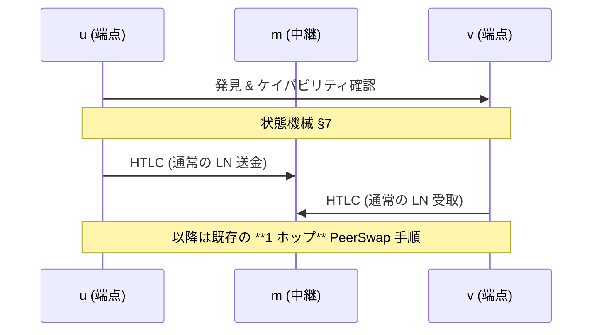
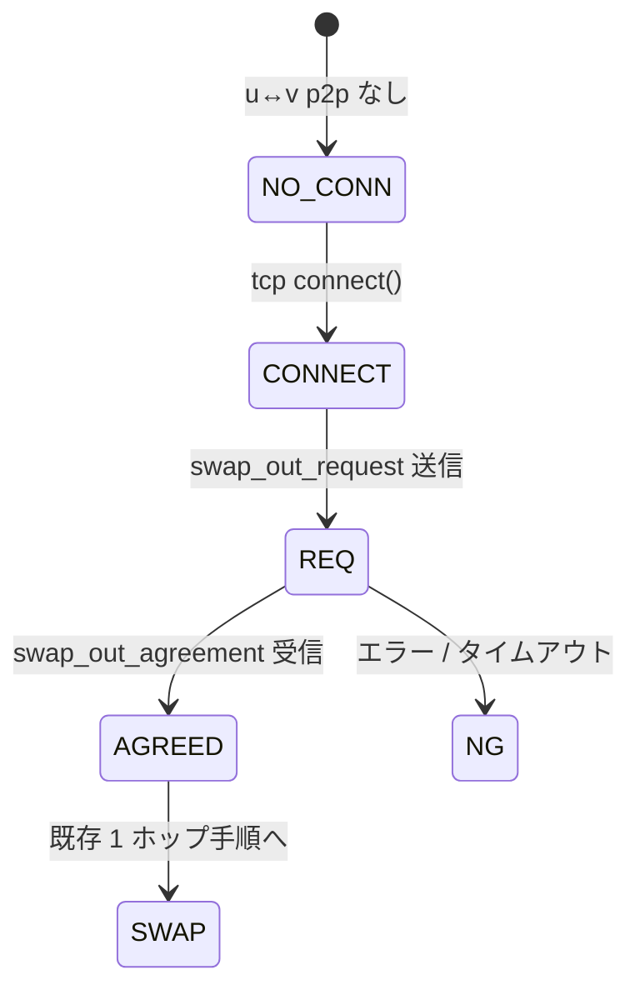
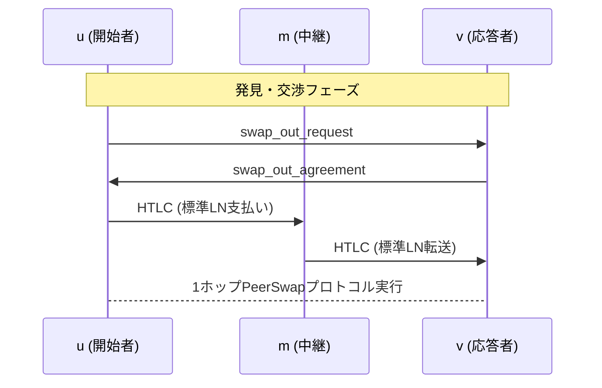
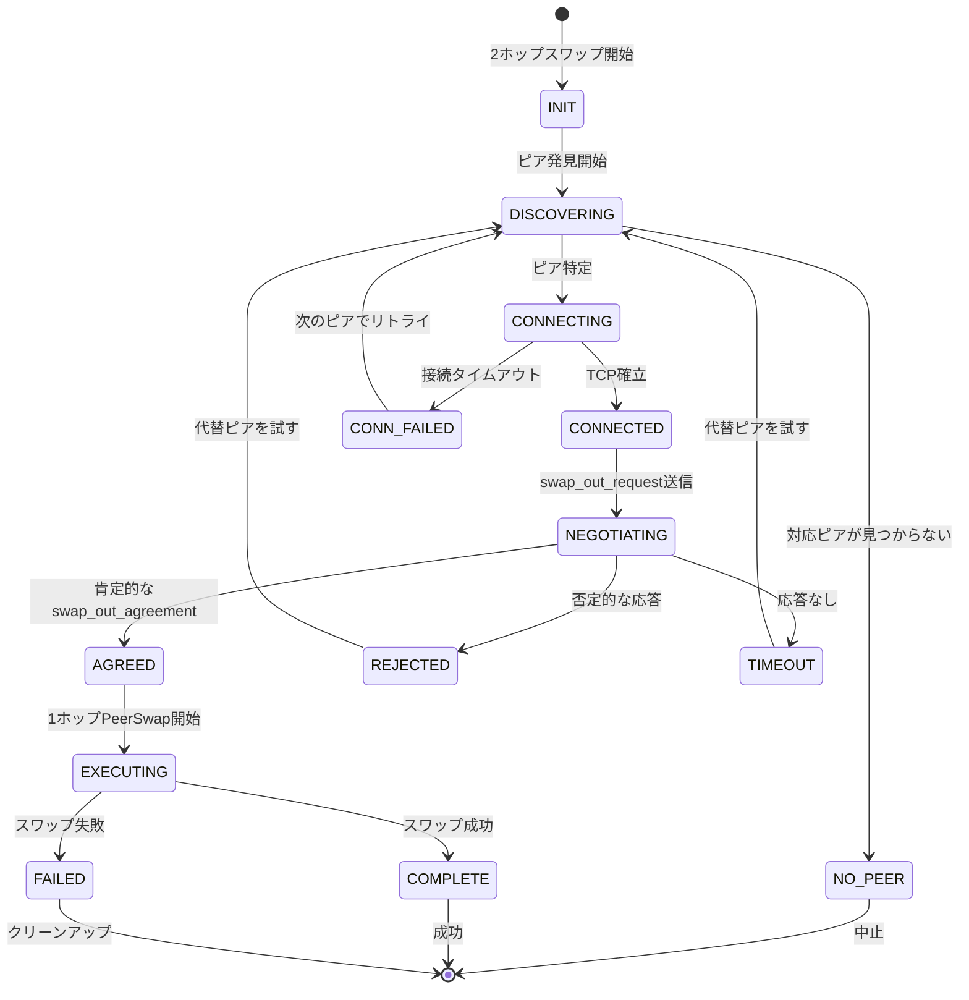

2hop peerswapの提案のdraft。

## 1. 動機

PeerSwapは **直結（1 ホップ）** の 2 ノード間でオンチェーン資産を
アトミックに交換できる。  
実ネットワークには「間に 1 ノードだけ挟まる 2 ホップ経路」
`u → m → v` が多数存在するため，ここでもスワップを可能にしたい。

* 追加チャネルを開かずに流動性を解放  
* 中継ノード *m* の協力や信頼は一切不要  
* 既存の 1 ホップ・プロトコルを端点 u・v ではそのまま利用

本提案では追加メッセージと状態機械を最小限に抑え，
後方互換性を保った **intermediary-agnostic** な拡張を示す。

---

## 2. ネットワークモデル

```text
u──ch₁──m──ch₂──v
 ↕  p2p (tcp) ↕
```

* `ch₁`, `ch₂` は通常の公開 LN チャネル  
* **u**, **v** は `lncli connect` 等で p2p 接続し，
  カスタムメッセージ (BOLT-1) を送受信できる  
* 中継 *m* が PeerSwap 対応かどうかは問わない

---

## 3. 全体フロー



新たに必要なのは **発見** と **交渉** の 2 メッセージだけ。

---

## 4. ワイヤメッセージ  
*(すべて奇数 type → 旧ノードは無視)*

<details>
<summary><code>swap_out_request (type = 54810)</code></summary>

```tlv
tlv_stream SwapOutRequest
{
    [1]  : u64   version          ; 現状 1
    [3]  : bytes swap_id          ; 16–32 B ランダム
    [5]  : bytes asset            ; "BTC" / "LBTC" …
    [7]  : bytes network          ; "mainnet" / "signet" …
    [9]  : u64   scid             ; ch₁ の short_channel_id
    [11] : u64   spendable        ; u→m 送金可能額 (msat)
    [13] : bytes intermediary_key ; m の pubkey (33 B)
    [15] : bytes pubkey           ; u の pubkey (33 B)
}
```
</details>

<details>
<summary><code>swap_out_agreement (type = 54811)</code></summary>

```tlv
tlv_stream SwapOutAgreement
{
    [1] : u64  version
    [3] : bytes swap_id     ; エコー
    [5] : u64  amount_msat  ; min(spendable, receivable)
    [7] : u64  receivable   ; v←m 受取可能額 (msat)
    [9] : bytes error       ; 非空なら拒否理由
}
```
</details>

1 往復で十分。以降は元の 1 ホップ状態機械へ合流。

---

## 5. 金額計算

```
amount_msat = min( spendable(u→m), receivable(v←m) )
```

*m* のプライバシーは守られる；端点は自身の `listchannels` だけを参照。

---

## 6. ピア発見戦略

| 戦略                                                                 | *m* が PeerSwap 必須? | 長所         | 短所                   |
| -------------------------------------------------------------------- | --------------------- | ------------ | ---------------------- |
| **A – Poll 拡張**<br>`connected_peers` を *m* が周期ブロードキャスト | yes                   | 低レイテンシ | *m* 非対応なら機能せず |
| **B – 直接プローブ**<br>u が v と p2p 接続し小さなカスタム msg 送信  | no                    | どこでも動作 | p2p 接続が 2 回増える  |

実装はまず A を試し，失敗時に B へフォールバックしてもよい。

---

## 7. fsm



遷移は冪等。単純リトライで OK。

---

## 8. セキュリティ & プライバシー

* *m* はプリイメージや鍵を一切受け取らず，2 本の HTLC を中継するだけ  
* 失敗パス (cancel / coop-close / CSV) は既存と同一  
* 旧ノードは新 TLV を無視し問題なく動作

---

## 11. 結論

本 2 ホップ拡張により，到達可能なスワップ相手が飛躍的に増える。  
実装コストは低く，後方互換性も保たれる。  

# 2ホップPeerSwap: 直接チャネルを超えたアトミックスワップの拡張

## 概要

本提案は、2ホップ経路（u → m → v）で接続されたLightning Networkノード間でのアトミックなオンチェーン/オフチェーン資産スワップを可能にするPeerSwapプロトコルの拡張である。設計は後方互換性を維持し、中継ノードmからの協力を必要とせず、わずか2つの新しいメッセージタイプで最小限のプロトコルオーバーヘッドを実現する。

## 1. 導入と動機

### 背景

PeerSwapは現在、チャネルを共有する2つのLightningノード間での**直接（1ホップ）**アトミック交換を可能にしている。しかし、Lightning Networkのトポロジーは、多くの潜在的なスワップパートナーが正確に1つの中継ノードで分離されている - 一般的な2ホップパスパターンを示している。

### 問題提起

直接チャネルへの制限は、利用可能なスワップパートナーのプールを大幅に削減する。ネットワーク分析によると、2ホップスワップを有効にすることで、ノードの接続性に応じて、到達可能なスワップパートナーが10〜100倍増加する可能性がある。

### 設計目標

1. **追加チャネル不要**: 新しいチャネル開設を必要とせずにスワップを可能にする
2. **中継ノード非依存**: 中継ノード*m*はPeerSwapサポートや信頼の前提を必要としない
3. **後方互換性**: エンドポイントで既存の1ホップPeerSwapプロトコルを利用
4. **最小限のオーバーヘッド**: 必要不可欠なメッセージと状態遷移のみを追加
5. **アトミック実行**: 1ホップスワップと同じアトミック性の保証を維持

### 関連研究

- **PeerSwap v1**: アトミックなオンチェーン/オフチェーンスワップの基礎プロトコル（[Blockstream, 2022](https://github.com/ElementsProject/peerswap)）
- **Submarine Swaps**: オンチェーンHTLCを必要とする代替スワップメカニズム（[Alex Bosworth, 2018](https://submarineswaps.org)）
- **Loop**: Lightning Labsの非カストディアルスワップサービス
- **Trampoline Routing**: 同様の機能を可能にする可能性のある委任ベースのルーティング

## 2. システムモデルと前提条件

### ネットワークトポロジー

```
┌───┐          ┌───┐          ┌───┐
│ u │══════════│ m │══════════│ v │
└───┘   ch₁    └───┘   ch₂    └───┘
  │                              │
  └──────────p2p (TCP)───────────┘
```

### コンポーネント

- **チャネル**: `ch₁`と`ch₂`は標準的な公開Lightningチャネル
- **直接通信**: ノード**u**と**v**はカスタムメッセージ（BOLT-1）のための直接p2p接続を確立
- **中継ノード**: ノード*m*はPeerSwap認識や特別な機能を必要としない

### 前提条件

1. **チャネル流動性**: 両方のチャネルがスワップ金額に十分な流動性を持つ
2. **ネットワーク接続性**: uとvが直接TCP接続を確立できる
3. **プロトコルサポート**: uとvがPeerSwap互換の実装を実行
4. **アトミック保証**: 既存のLightning HTLCと同じ信頼モデル

## 3. プロトコル概要

### ハイレベルフロー



### 重要な洞察

1. **最小限の拡張**: 発見と交渉のための新しいメッセージはわずか2つ
2. **既存プロトコルの再利用**: セットアップ後は1ホップPeerSwap実行と同一
3. **透過的な中継**: 中継ノードは標準的なLightning支払いのみを処理

## 4. メッセージ仕様

### 設計原則

- **奇数タイプ番号**: 後方互換性を確保（非対応ノードは無視）
- **TLVフォーマット**: 将来の拡張に対応
- **最小ラウンドトリップ**: 単一のリクエスト・レスポンス交換

### 4.1 swap_out_request (type = 54810)

2ホップスワップ交渉を開始する。

```rust
tlv_stream SwapOutRequest {
    [1]  : u64   version          // プロトコルバージョン（現在1）
    [3]  : bytes swap_id          // 一意識別子（16-32バイトのランダム）
    [5]  : bytes asset            // 資産タイプ: "BTC", "LBTC"など
    [7]  : bytes network          // ネットワーク: "mainnet", "testnet", "signet"
    [9]  : u64   scid             // ch₁のshort_channel_id
    [11] : u64   spendable_msat   // 利用可能な送信流動性 u→m
    [13] : bytes intermediary_key // 中継ノードmの公開鍵（33バイト）
    [15] : bytes pubkey           // 開始者uの公開鍵（33バイト）
    [17] : u64   min_amount_msat  // 最小許容スワップ額（オプション）
    [19] : u64   max_amount_msat  // 最大許容スワップ額（オプション）
    [21] : u32   timeout_blocks   // スワップタイムアウト（ブロック数）（オプション）
}
```

### 4.2 swap_out_agreement (type = 54811)

スワップリクエストに合意または拒否で応答する。

```rust
tlv_stream SwapOutAgreement {
    [1]  : u64   version        // プロトコルバージョンのエコー
    [3]  : bytes swap_id        // リクエストからのswap_idのエコー
    [5]  : u64   amount_msat    // 合意スワップ額: min(spendable, receivable)
    [7]  : u64   receivable     // 利用可能な受信流動性 v←m
    [9]  : bytes error          // 拒否時のエラーメッセージ（承諾時は空）
    [11] : u32   fee_rate       // オンチェーン手数料率 sat/vByte（オプション）
    [13] : bytes conditions     // 追加条件/パラメータ（オプション）
}
```

### エラーコード

`error`フィールドの標準化されたエラーメッセージ：

- `insufficient_liquidity`: チャネル容量が不足
- `swap_in_progress`: 別のスワップを処理中
- `unsupported_asset`: 資産タイプがサポートされていない
- `rate_limit`: スワップリクエストが多すぎる
- `channel_unusable`: チャネルがオフラインまたはクローズ中

## 5. スワップ金額計算

### 基本式

```
スワップ金額 = min(
    spendable(u→m) - reserve(u),
    receivable(v←m) - reserve(v)
)
```

### 考慮事項

1. **チャネルリザーブ**: 両当事者は最小チャネルリザーブを維持する必要がある
2. **ルーティング手数料**: mを通じたLightning支払いの手数料を考慮する必要がある
3. **同時HTLC**: 既存の未決済支払いが利用可能な流動性に影響する
4. **プライバシー保護**: 中継ノードmの正確な残高はプライベートに保たれる

### 詳細な計算

```python
def calculate_swap_amount(u_spendable, v_receivable, fee_base, fee_rate):
    # ルーティング手数料を考慮
    max_forward = u_spendable - fee_base
    max_receive = v_receivable
    
    # 比例手数料を適用
    max_amount = min(
        max_forward / (1 + fee_rate),
        max_receive
    )
    
    # 最小実行可能性を確保
    if max_amount < MIN_SWAP_AMOUNT:
        return 0
    
    return max_amount
```

## 6. ピア発見メカニズム

### 戦略比較

| 戦略                       | 説明                                                    | 中継要件             | 利点                 | 欠点             |
| -------------------------- | ------------------------------------------------------- | -------------------- | -------------------- | ---------------- |
| **A - ゴシップ拡張**       | 中継が`connected_peers`リストを定期的にブロードキャスト | PeerSwapサポート     | 低レイテンシ、効率的 | 中継の協力が必要 |
| **B - 直接プローブ**       | 開始者が潜在的なピアに直接接続                          | なし                 | 汎用互換性           | 追加のp2p接続    |
| **C - DHTベース**          | ピア発見のための分散ハッシュテーブル                    | なし                 | スケーラブル、分散型 | 複雑な実装       |
| **D - トランポリンヒント** | トランポリンルーティングヒントを活用                    | トランポリンサポート | 既存インフラの再利用 | 限定的な展開     |

### 推奨実装

```python
def discover_2hop_peers():
    # まずゴシップ拡張を試す（最速）
    peers = try_gossip_discovery()
    
    if not peers:
        # 直接プローブにフォールバック
        peers = direct_probe_discovery()
    
    return filter_capable_peers(peers)
```

### プライバシーの考慮事項

- **トポロジーの漏洩**: 直接プローブは特定のパスへの関心を明らかにする
- **タイミング分析**: 発見パターンがスワップの意図を明らかにする可能性がある
- **緩和策**: ランダムな遅延とダミープローブを推奨

## 7. 状態機械仕様

### 状態図



### 状態遷移

| 現在の状態  | イベント            | 次の状態    | アクション     |
| ----------- | ------------------- | ----------- | -------------- |
| INIT        | ユーザー開始        | DISCOVERING | 発見開始       |
| DISCOVERING | ピア発見            | CONNECTING  | 接続試行       |
| CONNECTING  | 接続済み            | CONNECTED   | 交渉準備       |
| CONNECTED   | リクエスト送信      | NEGOTIATING | 応答待ち       |
| NEGOTIATING | 合意受信            | AGREED      | スワップに進む |
| AGREED      | Lightning支払い送信 | EXECUTING   | PeerSwap実行   |

### タイムアウト管理

- **接続タイムアウト**: 10秒
- **交渉タイムアウト**: 30秒
- **スワップ実行タイムアウト**: PeerSwapプロトコルによって定義

### エラー回復

すべての遷移は冪等であり、安全なリトライが可能：

```python
def handle_state_transition(current_state, event):
    MAX_RETRIES = 3
    retry_count = 0
    
    while retry_count < MAX_RETRIES:
        try:
            return transition(current_state, event)
        except TransientError:
            retry_count += 1
            await exponential_backoff(retry_count)
    
    return FAILED
```

## 8. セキュリティ分析

### 8.1 信頼モデル

- **追加の信頼不要**: 中継ノードmは資金を盗んだりスワップの詳細を知ることができない
- **アトミック実行**: スワップは完全に完了するか、まったく完了しないかのいずれか
- **標準HTLCセキュリティ**: Lightning Networkの既存のセキュリティプロパティを継承

### 8.2 攻撃ベクトルと緩和策

#### 中間者攻撃
- **脅威**: 中継がメッセージの変更を試みる可能性
- **緩和策**: 暗号化認証を伴う直接p2p接続

#### サービス拒否
- **脅威**: 完了せずに悪意のあるスワップ開始
- **緩和策**: レート制限、評判システム、少額手数料

#### プライバシー漏洩
- **脅威**: スワップパターンが経済的関係を明らかにする
- **緩和策**: ランダム化された金額、タイミング、ダミースワップ

#### 流動性グリーフィング
- **脅威**: スワップを完了せずに流動性をロック
- **緩和策**: タイムアウトメカニズム、同時スワップ制限

### 8.3 プライバシーの考慮事項

1. **残高プライバシー**: 正確なチャネル残高はすべての当事者から隠される
2. **スワッププライバシー**: 中継はスワップ条件や完了を判断できない
3. **ネットワークプライバシー**: p2p接続にはTorの使用を推奨
4. **タイミングプライバシー**: ランダムな遅延が相関攻撃を防ぐ

### 8.4 障害モード

プロトコルは様々な障害シナリオを優雅に処理する：

- **ネットワーク障害**: タイムアウトが自動クリーンアップをトリガー
- **ノード障害**: 資金のリスクなし、標準的なLightning回復
- **悪意のある動作**: アトミックスワップが部分的実行を防ぐ

## 9. 実装の考慮事項

### 9.1 統合ポイント

#### Lightning実装
- **CLN**: プラグインアーキテクチャがクリーンな統合を可能にする
- **LND**: インターセプターAPIがメッセージ処理を可能にする
- **Eclair**: プラグインシステムがカスタムメッセージをサポート
- **LDK**: モジュラー設計が拡張を容易にする

#### コード構造
```
2hop-peerswap/
├── discovery/
│   ├── gossip.rs
│   └── probe.rs
├── negotiation/
│   ├── messages.rs
│   └── state_machine.rs
├── execution/
│   └── swap_coordinator.rs
└── tests/
    ├── integration/
    └── unit/
```

### 9.2 設定パラメータ

```toml
[2hop_peerswap]
# 発見設定
discovery_strategy = "hybrid"  # gossip_first, probe_only, hybrid
discovery_timeout_ms = 30000

# 交渉設定  
max_concurrent_swaps = 3
min_swap_amount_sat = 10000
max_swap_amount_sat = 1000000

# セキュリティ設定
require_tor = false
rate_limit_per_hour = 10
```

### 9.3 パフォーマンスメトリクス

- **発見レイテンシ**: 通常5秒未満
- **交渉オーバーヘッド**: スワップあたり約100バイト
- **成功率**: 良好なピア選択で85%以上
- **追加RTT**: 1ホップPeerSwapを超えて2-3

## 10. 経済分析

### 10.1 利点

1. **流動性アクセスの増加**: 潜在的なスワップパートナーが10〜100倍
2. **資本効率**: 追加のチャネル開設が不要
3. **ネットワーク効果**: 参加者が増えることですべての人の効用が増加

### 10.2 コスト

1. **開発**: 一度きりの実装作業
2. **運用**: 最小限の追加リソース使用
3. **機会費用**: スワップ実行中のロックされた流動性

### 10.3 インセンティブ互換性

- **開始者**: リモート流動性へのアクセスを獲得
- **応答者**: スワップスプレッド/手数料から収益
- **中継**: 直接的な利益はないが、コストもない

## 11. 今後の作業

### 短期
1. **リファレンス実装**: CLNとLNDプラグインの完成
2. **標準化**: BOLT仕様のドラフト
3. **テスト**: 包括的なテストスイートとシミュレーション

### 中期
1. **マルチホップ拡張**: nホップパスへの一般化
2. **バッチスワップ**: 単一の交渉での複数のスワップ
3. **手数料市場**: スワップサービスの動的価格設定

### 長期
1. **プライバシー強化**: ルートブラインディングとの統合
2. **クロスチェーンスワップ**: 他の資産への拡張
3. **自動マーケットメイキング**: アルゴリズムによるスワップ提供

## 12. 結論

2ホップPeerSwap拡張は、Lightning Networkのスワップ機能の自然な進化を表している。最小限のプロトコルオーバーヘッドと追加の信頼要件なしに2ホップパス全体でのスワップを可能にすることで、ユーザーが期待するセキュリティプロパティを維持しながら、流動性へのアクセシビリティを劇的に向上させることができる。

設計の優雅さはそのシンプルさにある：わずか2つの新しいメッセージが、桁違いに多くのスワップパートナーへのアクセスを可能にする。実装は簡単で、後方互換性は維持され、セキュリティモデルは変更されない。

Lightning開発者コミュニティがこの提案をレビューし、フィードバックを提供し、それぞれのプロジェクトでの実装を検討することを奨励する。

## 参考文献

1. [PeerSwap仕様](https://github.com/ElementsProject/peerswap)
2. [BOLT #1: 基本プロトコル](https://github.com/lightning/bolts/blob/master/01-messaging.md)
3. [Lightning Networkトポロジー分析](https://arxiv.org/abs/2107.14178)
4. [Lightning上のアトミックスワップ](https://lists.linuxfoundation.org/pipermail/lightning-dev/2019-January/001798.html)

## 付録A: メッセージ例

### A.1 成功した交渉

```json
// swap_out_request
{
  "version": 1,
  "swap_id": "a8d4c2f6e8b1d3a5c7e9f1b3d5a7c9e1",
  "asset": "BTC",
  "network": "mainnet",
  "scid": 123456789,
  "spendable_msat": 50000000,
  "intermediary_key": "03abc...def",
  "pubkey": "02123...456"
}

// swap_out_agreement
{
  "version": 1,
  "swap_id": "a8d4c2f6e8b1d3a5c7e9f1b3d5a7c9e1",
  "amount_msat": 45000000,
  "receivable": 48000000,
  "error": ""
}
```

### A.2 拒否例

```json
// swap_out_agreement (拒否)
{
  "version": 1,
  "swap_id": "a8d4c2f6e8b1d3a5c7e9f1b3d5a7c9e1",
  "amount_msat": 0,
  "receivable": 1000000,
  "error": "insufficient_liquidity"
}
```  


# 2ホップPeerSwap: 潜在的な批判ポイント

このドキュメントは、2ホップPeerSwap提案がコミュニティの議論で批判を受けたり、明確化が必要となる可能性のある領域をリスト化したものです。

## 1. 技術設計への批判

### プロトコルの複雑性
- **メッセージフローの効率性**: 新しいメッセージが2つだけというのは最小限すぎるのでは？エッジケースはどうなる？
- **状態機械の完全性**: FSMが簡略化されているように見える - タイムアウト処理、リトライ、エラー回復状態はどうなっている？
- **後方互換性**: 奇数メッセージタイプの使用は役立つが、ノードバージョンが混在する場合のスムーズな劣化をどう保証する？

### セキュリティの懸念
- **中間者攻撃**: プロトコルは中継者によるメッセージ操作をどのように防ぐのか？
- **リプレイ攻撃**: swap_idは適切にランダム化され、一意であるか？リプレイを防ぐものは何か？
- **プライバシー漏洩**: spendable/receivable金額の開示はチャネル状態を過度に露出させないか？
- **競合状態**: uとvが同時にスワップを開始した場合はどうなる？

### 金額計算の問題
- **リザーブ要件**: min()計算はチャネルリザーブを考慮していない
- **手数料の考慮**: ルーティング手数料は金額計算でどのように処理される？
- **同時HTLC**: すでに保留中のHTLCが利用可能な流動性に影響している場合はどうなる？

## 2. 実装上の課題

### 発見メカニズム
- **ポーリングのスケーラビリティ**: 戦略Aはすべての中継者がPeerSwapをサポートすることを要求 - 非現実的な仮定では？
- **接続オーバーヘッド**: 戦略Bの「2つの追加p2p接続」は規模が大きくなると重要になる可能性
- **プライバシーへの影響**: 直接プローブはネットワークトポロジー情報を明らかにする可能性

### 運用上の懸念
- **アトミック性の保証**: 2ホップスワップが真にアトミックであることをどう保証する？
- **障害回復**: 中継者がスワップの途中でオフラインになった場合はどうなる？
- **経済的インセンティブ**: なぜ中継者は補償なしに参加するのか？

## 3. 経済とゲーム理論の問題

### インセンティブの整合性
- **無料中継の問題**: 中継者はコストを負担するが直接的な利益を受けない
- **流動性のロックアップ**: スワップ実行中にチャネル資金がロックされる
- **グリーフィング攻撃**: 悪意のある行為者がスワップを完了せずに開始する可能性

### 市場ダイナミクス
- **価格発見**: 当事者はスワップレートにどのように合意するのか？
- **流動性の断片化**: これは別々の流動性プールを作成するのか？
- **既存ソリューションとの競争**: なぜサブマリンスワップや他のメカニズムではなくこれを使うのか？

## 4. 仕様の欠落

### プロトコルの詳細
- **タイムアウト値**: 妥当なタイムアウト期間の仕様がない
- **エラー処理**: `swap_out_agreement`でのエラーメッセージ形式が最小限
- **メッセージサイズ制限**: 最大メッセージサイズについての議論がない
- **バージョンネゴシエーション**: ノードはバージョンの不一致をどのように処理する？

### 統合ポイント
- **既存のPeerSwap互換性**: 現在の1ホップPeerSwapとどのように統合される？
- **ウォレット統合**: ユーザーエクスペリエンスの考慮事項が対処されていない
- **監視とデバッグ**: 可観測性についての議論がない

## 5. より広いエコシステムの懸念

### 標準化
- **BOLT仕様**: これには適切なBOLT提案が必要
- **リファレンス実装**: 実装状況についての言及がない
- **テスト方法論**: 安全な環境でこれをどのようにテストする？

### 採用の障壁
- **ネットワーク効果**: 有用であるためには重要な採用が必要
- **アップグレードの調整**: ネットワーク全体でアップグレードをどのように調整する？
- **ドキュメント**: 現在のドラフトには詳細な例とユースケースが不足

## 6. 代替アプローチ

### 比較の欠如
- **トランポリンルーティング**: トランポリンノードとどのように比較される？
- **アトミックマルチパス支払い**: AMPは同様の目標を達成できるか？
- **他のスワッププロトコル**: Loop、Boltzなどとの比較がない

### 設計決定
- **なぜLightningメッセージか？**: 他の通信チャネルを使用できるか？
- **なぜHTLCを直接使用しないのか？**: カスタムプロトコルの正当化が必要
- **中継者非依存の主張**: これは本当にどの中継者でも機能するのか？

## 7. パフォーマンスの考慮事項

### レイテンシ
- **ラウンドトリップ時間**: 複数のp2p接続がレイテンシを追加
- **メッセージ伝播**: ネットワーク距離に対してどのようにスケールする？

### スループット
- **チャネル容量の利用**: これはチャネル効率を改善するか悪化させるか？
- **同時スワップ制限**: 同時に何個のスワップを実行できる？

## 8. 将来性の確保

### 拡張性
- **プロトコルバージョニング**: バージョンフィールドは将来の変更に十分か？
- **機能ネゴシエーション**: オプション機能のメカニズムがない
- **アップグレードパス**: v1からv2にどのように移行する？

### 長期的な実行可能性
- **コベナントベースの代替案**: 将来のOP_CTVソリューションとどのように比較される？
- **チャネルファクトリー**: チャネルファクトリーでこれは時代遅れになるか？
- **Taproot統合**: Taprootチャネルの利点についての議論がない