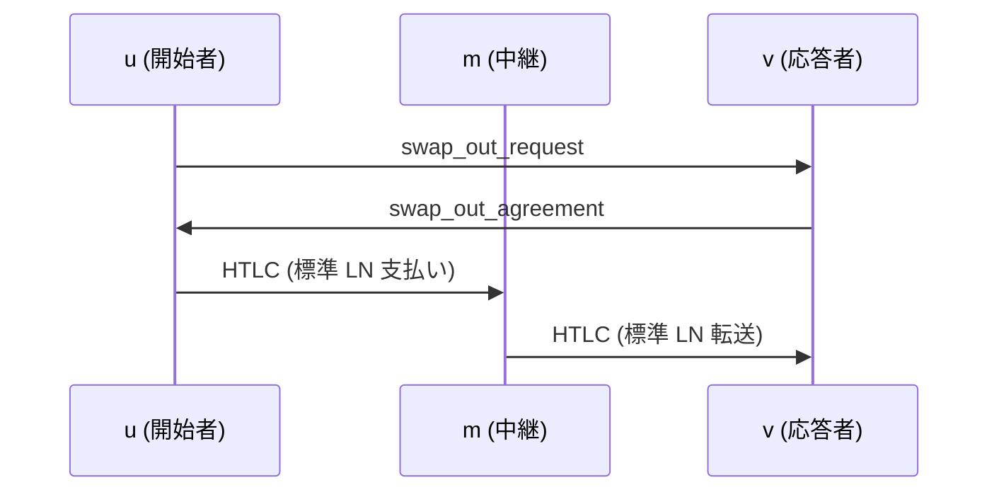
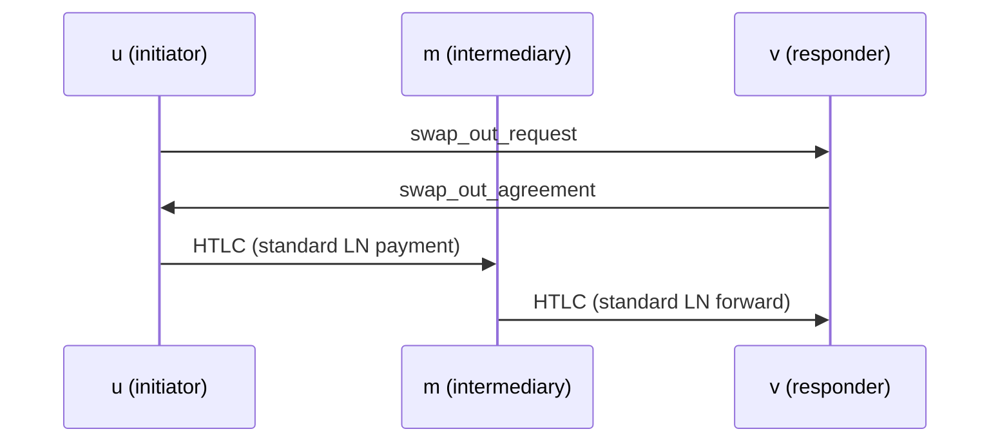

https://github.com/ElementsProject/peerswap/discussions/397  で提案したもの。

2 ホップ `u → m → v` でもアトミック交換できる最小拡張を定義する。  

Define the minimal extension that enables atomic swaps even over a 2-hop path `u → m → v`.

## 動機

PeerSwapは2ノード間でオンチェーン資産をアトミックに交換できる。一方、実ネットワークには「間に1ノードだけ挟まる2ホップ経路 `u → m → v`」が多数存在するため、ここでもスワップを可能にしたい。

* 追加チャネルを開かずに流動性を解放
* 中継ノード m の協力や信頼は不要
* 端点 u・v 側の既存 1 ホップ・プロトコルはそのまま利用

## Motivation

PeerSwap can perform atomic swap between direct nodes. However, in real networks many two-hop paths exist where exactly one intermediary node forms the route, `u → m → v`. We therefore want to enable swaps over these paths as well.

* Release liquidity without opening additional channels  
* No cooperation or trust required from the relay node m  
* Keep using the existing one-hop protocol on the endpoint nodes u and v as is

## ネットワークモデル

```
u──ch₁──m──ch₂──v
 ↕  p2p (tcp) ↕
```

* `ch₁`, `ch₂` は**公開 LN チャネル**
* **`u`と`v`はp2p接続済み**（BOLT#1のカスタムメッセージを送受信可）
* **中継 m が PeerSwap 対応かどうかは問わない**

**記号**

* `u`: 開始者（initiator）
* `m`: 中継（intermediary）
* `v`: 応答者（responder）

## Network Model

```
u──ch₁──m──ch₂──v
↕  p2p (tcp) ↕
```

* `ch₁` and `ch₂` are public LN channels
* `u` and `v` are already connected via p2p (TCP) and can exchange BOLT-#1 custom messages
* It is irrelevant whether the relay node `m` supports PeerSwap or not

**Notation**

* `u`: initiator  
* `m`: intermediary  
* `v`: responder


## 全体フロー



* 支払い/転送は **標準 LN（HTLC）** により `u → m → v` で行われる

## Overall Flow



* The payment/forwarding is carried out via standard LN HTLCs along the route `u → m → v`.

## ワイヤメッセージ（既存 JSON の拡張）

**方針**

* **新しいメッセージタイプは定義しない**
* **既存のJSONメッセージ**を、**オプショナルな追加フィールド**で拡張する
* **既存フィールドの意味は変更しない**
* **追加フィールドはすべて OPTIONAL**。未対応ノードは**無視**できる
* **`twohop`** は**2ホップdiscoveryモード**を示すJSONコンテナであり、存在する場合のみ**2ホップとして解釈**する。

**対象メッセージ**（typeは既存のまま）

* `swap_in_request`（JSON, **type=42069**）
* `swap_in_agreement`（JSON, **type=42073**）
* `swap_out_request`（JSON, **type=42071**）
* `swap_out_agreement`（JSON, **type=42075**）
* `opening_tx_broadcasted` ほかは**変更なし**

## Messages

Policy

* No new message types are introduced.  
* The existing JSON messages are extended with additional optional fields.  
* The semantics of existing fields are unchanged.  
* All added fields are OPTIONAL; nodes that do not understand them simply ignore them.  
* The JSON container twohop indicates “2-hop discovery mode”; the message is interpreted as 2-hop only when this container is present.

Affected messages (type numbers stay the same)

* swap_in_request  (JSON, type = 42069)  
* swap_in_agreement (JSON, type = 42073)  
* swap_out_request (JSON, type = 42071)  
* swap_out_agreement (JSON, type = 42075)  
* opening_tx_broadcasted and the rest remain unchanged

### `swap_out_request`

**追加フィールド**

* `twohop`: object — 2ホップdiscoveryモードを示すコンテナ。存在すれば受信側は2ホップとして解釈する。
  * `twohop.intermediary_pubkey`: string（**33B圧縮pubkey, hex**）— 中継ノード**m**のpubkey

**動作**

* `twohop` が存在する場合、**受信者v** は `intermediary_pubkey` からローカルの**`ch₂`（m–v）**を特定する。**自身の`receivable_msat` を算出**し、**実行可能金額の範囲内かどうか**を判定する。

**互換性**
* `twohop` を理解しない旧ノードは未知フィールドを無視し、**`scid`が直接チャネルでない／`amount=0`等**の理由で**安全に拒否**される。

### `swap_out_agreement`

**追加フィールド**（いずれも **optional**）

* `twohop`: object — 2ホップdiscoveryの応答結果。
  * `twohop.incoming_scid`: string（例: `"x:y:z"`）— **`ch₂`（m–v）** の **short\_channel\_id**

**動作**
* `twohop` が存在する場合、**受信者u** は`incoming_scid` を経由する2ホップ経路で `payreq` へ支払う。

**備考**
* **ルートヒントは使用しない**。**送信者が送金のrouteを固定**する（**LNの標準API**で対応可能）。
* ルートヒントは**routeを確実に固定できない**ため。

### `swap_in_request`

**追加フィールド**

* `twohop`: object — 2ホップdiscoveryモードを示すコンテナ。存在すれば受信側は2ホップとして解釈する。
  * `twohop.intermediary_pubkey`: string（**33B圧縮pubkey, hex**）— 中継ノード**m**のpubkey

**動作**
* `twohop` が存在する場合、**受信者v** は `intermediary_pubkey` からローカルの**`ch₂`（m–v）**を特定し、要求された**`amount`**を**送信可能か**確認する。

**互換性**
* `twohop` を理解しない旧ノードは未知フィールドを無視し、現行仕様どおりの検証（`scid`／`amount`等）で**拒否**される。

### `swap_in_agreement`

**追加フィールド**（いずれも **optional**）

* `twohop`: object — 2ホップdiscoveryの応答結果。
  * `twohop.incoming_scid`: string（例: `"x:y:z"`）— **`ch₂`（m–v）**の**short\_channel\_id**（**v側から見たm→v**）

**動作**

* `twohop` が存在する場合、
  **応答者v** は支払い時に、**`incoming_scid` の受取可能額**を確認する。
  **`amount`**を満たす必要がある。


## Doing the Swap

* `twohop` が存在する場合、**swap maker** は
  `intermediary_pubkey` からローカルの**`ch₁`（u–m）**を特定する。
  **`incoming_scid` を経由する2ホップ経路で `payreq` へ支払う。**

### `swap_out_request`

Additional Fields

* `twohop`: object — A container that signals 2-hop discovery mode.  
  The receiver treats the message as 2-hop only when this object is present.  
  * `twohop.intermediary_pubkey`: string (33-byte compressed pubkey, hex) —  
    the pubkey of the intermediary node **m**

Behaviour

* When `twohop` is present, the receiver **v** derives its local channel  
  **`ch₂` (m–v)** from `intermediary_pubkey`, computes its own  
  **`receivable_msat`**, and decides whether the requested amount is within the
  executable range.

Compatibility

* A legacy node that does not understand `twohop` ignores the unknown field and
  will safely reject the request for ordinary reasons (e.g. the `scid`
  is not a direct channel or `amount = 0`).

### `swap_out_agreement`

Additional Fields (all OPTIONAL)

* `twohop`: object — The result of 2-hop discovery.  
  * `twohop.incoming_scid`: string (e.g. `"x:y:z"`) —  
    the short_channel_id of **`ch₂` (m–v)**

Behaviour

* If `twohop` is present, the receiver **u** pays the `payreq` via a 2-hop route
  that includes `incoming_scid`.

Notes

* Route hints are **not** used; the **sender pins the route** itself (doable with
  standard LN APIs).  
* Route hints cannot reliably force a fixed route.

### `swap_in_request`

Additional Fields

* `twohop`: object — Container that signals 2-hop discovery mode.  
  * `twohop.intermediary_pubkey`: string (33-byte compressed pubkey, hex) —  
    the pubkey of the intermediary node **m**

Behaviour

* When `twohop` is present, the receiver **v** identifies its local  
  **`ch₂` (m–v)** from `intermediary_pubkey` and checks whether the requested
  **`amount`** can be sent.

Compatibility

* A legacy node that does not understand `twohop` ignores the field and rejects
  the request using the current rules (`scid`, `amount`, etc.).

### `swap_in_agreement`

Additional Fields (all OPTIONAL)

* `twohop`: object — The result of 2-hop discovery.  
  * `twohop.incoming_scid`: string (e.g. `"x:y:z"`) —  
    the short_channel_id of **`ch₂` (m–v)**, viewed from **v** (m → v)

Behaviour

* If `twohop` is present, the responder **v**, when making the payment, verifies
  that the **receivable amount on `incoming_scid`** is sufficient for
  **`amount`**.

## Doing the Swap

* When `twohop` is present, the **swap maker** locates its local  
  **`ch₁` (u–m)** using `intermediary_pubkey`, then pays the `payreq` over the
  2-hop route that includes `scid`.

## `poll` メッセージの拡張（任意提案）

**目的**
中継**m**が自ノードの**`connected_peers`**を**周期ブロードキャスト**する。
これにより、**`u`と`v`が2ホップ候補を発見しやすくなる**。

### 方式
既存`poll`のJSONに**`neighbors_ad`**拡張を追加する。
未対応ノードは未知フィールドを無視でき、**後方互換**が保てる。
送信頻度・ライフサイクルは**`poll` と同調**で十分なケースが多い。

* 周期は一定間隔であり、**最新性は保証しない**
* **虚偽報告を防ぐ手段はない**ため、採用は**オプショナル**
* スワップ実行時は**2ホップ発見（4.1）**で**金額を確定**する

**新規メッセージ `poll`（JSON, type=42001）の拡張例**

```json
{
  "version": 5,
  "assets": ["btc", "lbtc"],
  "peer_allowed": true,
  "btc_swap_in_premium_rate_ppm": 100,
  "btc_swap_out_premium_rate_ppm": 200,
  "lbtc_swap_in_premium_rate_ppm": 50,
  "lbtc_swap_out_premium_rate_ppm": 150,
  "neighbors_ad": {
    "v": 1,
    "public_only": true,
    "limit": 20,
    "entries": [
      {
        "node_id": "<pubkey-of-neighbor>",
        "channels": [
          {
            "channel_id": 1234567890,
            "short_channel_id": "x:y:z",
            "active": true
            // オプション（既定は非送信）:
            // "local_balance": 0,
            // "remote_balance": 0
          }
        ]
      }
    ]
  }
}
```

**送信ポリシー**
送信時にはLNノードのチャネル一覧から、**公開・activeな近傍を抽出**。
既定では**残高情報は送信しない**（プライバシー保護）。設定で**approx／exact**を**opt-in**可。
`limit` を超える場合は **ランダム／スコア順**で間引き。
**送信トリガ**: `poll` 周期・起動直後の `request_poll` 応答時。

**受信側の扱い**
受信者は、**直接チャネルを持たない相手も含めて**2ホップ候補を整形して提示できる。

**2hop nodes（概念例）**

```json
[
  {
    "nodeid": "<v_pubkey>",
    "intermediary_nodeid": "<m_pubkey>",
    "outgoing_scid": "<ch1 u–m>",
    "incoming_scid": "<ch2 m–v>",
    "spendable_msat": 0,
    "receivable_msat": 0,
    "sent": {
      "total_swaps_out": 2,
      "total_swaps_in": 1,
      "total_sats_swapped_out": 5300000,
      "total_sats_swapped_in": 302938
    },
    "received": {
      "total_swaps_out": 1,
      "total_swaps_in": 0,
      "total_sats_swapped_out": 2400000,
      "total_sats_swapped_in": 0
    },
    "total_fee_paid": 6082,
    "swap_in_premium_rate_ppm": 100,
    "swap_out_premium_rate_ppm": 100
  }
]
```

実際のスワップ実行は**透過的にこのリストから選択可能**ですが、**同等条件なら1ホップが優先**されるべきです。

## Extension of the `poll` Message (Optional Proposal)

### Purpose  
Let the intermediary **m** periodically broadcast its own **`connected_peers`** list.  
Doing so makes it easier for **u** and **v** to discover potential 2-hop routes.

### Method
Add an optional **`neighbors_ad`** object to the existing `poll` JSON.  
Nodes that do not understand the field simply ignore it, so backward compatibility is preserved.  
In most cases it is sufficient to send it on the same schedule as the ordinary `poll`.

* The broadcast interval is fixed; freshness is **not** guaranteed.  
* Because there is **no defence against false reports**, using this extension is **optional**.  
* When the swap is actually executed, the amount is finalised with the **2-hop discovery (Section 4.1)** step.

Example of the extended `poll` message (JSON, type = 42001):

```json
{
  "version": 5,
  "assets": ["btc", "lbtc"],
  "peer_allowed": true,
  "btc_swap_in_premium_rate_ppm": 100,
  "btc_swap_out_premium_rate_ppm": 200,
  "lbtc_swap_in_premium_rate_ppm": 50,
  "lbtc_swap_out_premium_rate_ppm": 150,
  "neighbors_ad": {
    "v": 1,
    "public_only": true,
    "limit": 20,
    "entries": [
      {
        "node_id": "<pubkey-of-neighbor>",
        "channels": [
          {
            "channel_id": 1234567890,
            "short_channel_id": "x:y:z",
            "active": true
            // Optional (not sent by default):
            // "local_balance": 0,
            // "remote_balance": 0
          }
        ]
      }
    ]
  }
}
```

### Sending policy  
When transmitting, the LN node extracts **public and active** neighbours from its channel list.  
By default no balance information is sent (privacy).  The operator may opt-in to send **approx / exact** values.  
If the number of neighbours exceeds `limit`, prune by **random / score order**.  
Send triggers: the regular `poll` interval and the reply to an initial `request_poll`.

### Receiver behaviour  
A listener can build a list of 2-hop candidates — even to nodes with which it does **not** share a direct channel.

Conceptual example of a 2-hop candidate list:

```json
[
  {
    "nodeid": "<v_pubkey>",
    "intermediary_nodeid": "<m_pubkey>",
    "outgoing_scid": "<ch1 u–m>",
    "incoming_scid": "<ch2 m–v>",
    "spendable_msat": 0,
    "receivable_msat": 0,
    "sent": {
      "total_swaps_out": 2,
      "total_swaps_in": 1,
      "total_sats_swapped_out": 5300000,
      "total_sats_swapped_in": 302938
    },
    "received": {
      "total_swaps_out": 1,
      "total_swaps_in": 0,
      "total_sats_swapped_out": 2400000,
      "total_sats_swapped_in": 0
    },
    "total_fee_paid": 6082,
    "swap_in_premium_rate_ppm": 100,
    "swap_out_premium_rate_ppm": 100
  }
]
```

When actually executing a swap, the implementation can pick transparently from this list, but — given equal conditions — a direct 1-hop path should always be preferred.

## ピア発見戦略

`poll` 拡張により、**2 ホップ swap 可能性や概算 capacity** を推測しやすくなる。これがなくとも**直接プローブ**により発見は可能だが、**能率は劣る**。

| 戦略                                                       | m が PeerSwap 必須か | 長所         | 短所                  |
| ---------------------------------------------------------- | -------------------- | ------------ | --------------------- |
| A – Poll 拡張（`connected_peers` 周期ブロードキャスト）    | yes                  | 低レイテンシ | m 非対応なら機能せず  |
| B – 直接プローブ（u が v と p2p 接続し軽量メッセージ送信） | no                   | どこでも動作 | p2p 接続が 2 回増える |

## Peer-Discovery Strategy

The `poll` extension makes it easier to estimate whether a 2-hop swap is possible and what the rough capacity might be.  
Even without it, discovery can still be done by probing directly, but this is less efficient.

| Strategy                                                                        | support required on m? | Pros             | Cons                                    |
| ------------------------------------------------------------------------------- | ---------------------- | ---------------- | --------------------------------------- |
| A – Poll extension (periodic broadcast of `connected_peers`)                    | yes                    | Low latency      | Useless if m does not support PeerSwap  |
| B – Direct probe (u opens a p2p connection to v and sends lightweight messages) | no                     | Works everywhere | Requires two additional p2p connections |