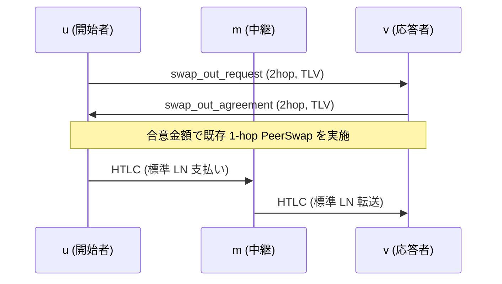

2hop peerswap の提案ドラフト。既存の 1 ホップ PeerSwap を維持したまま、実ネットで一般的な 2 ホップ経路 `u → m → v` でもスワップを可能にする最小拡張を示す。

## 1. 動機

PeerSwap は直結（1 ホップ）の 2 ノード間でオンチェーン資産をアトミックに交換できる。実ネットワークには「間に 1 ノードだけ挟まる 2 ホップ経路」 `u → m → v` が多数存在するため、ここでもスワップを可能にしたい。

- 追加チャネルを開かずに流動性を解放
- 中継ノード m の協力や信頼は不要（両端のローカル情報のみで判定）
- 端点 u・v 側の既存 1 ホップ・プロトコルはそのまま利用

本提案では、端点 u–v の間で「実行可能金額を 1RTT で合意するための発見メッセージ（TLV）」を追加し、その後の本編（既存の 1 ホップ JSON メッセージ群）は変更しない。

---

## 2. ネットワークモデル

```
u──ch₁──m──ch₂──v
 ↕  p2p (tcp) ↕
```

- `ch₁`, `ch₂` は公開 LN チャネル
- u と v は p2p 接続済み（BOLT#1 のカスタムメッセージを送受信可）
- 中継 m が PeerSwap 対応かどうかは問わない

---

## 3. 全体フロー



---

## 4. ワイヤメッセージ（既存 JSON の拡張）

本節では「新しいメッセージタイプは定義せず、既存の JSON メッセージをオプショナルな追加フィールドで拡張する」方針を規定する。既存フィールドの意味は変更しない。追加フィールドはすべて OPTIONAL で、未対応ノードは無視できる。

- 対象メッセージ
  - swap_out_request（JSON, type=42071）
  - swap_out_agreement（JSON, type=42075）
  - opening_tx_broadcasted ほかは変更なし

### 4.1 swap_out_request（JSON, type=42071）の拡張

追加フィールド（いずれも optional）:

- twohop: object — 2 ホップ discovery モードを示すコンテナ。存在すれば受信側は 2 ホップ解釈を行う。
  - twohop.intermediary_pubkey: string（33B 圧縮 pubkey, hex）— 中継ノード m の pubkey
  - twohop.outgoing_scid: string（例: "x:y:z"）— ch₁（u–m）の short_channel_id
  - twohop.spendable_msat: uint64 — 現時点の u→m 送金可能上限（msat）

動作:
- twohop が存在する場合、受信者 v は `intermediary_pubkey` からローカルの ch₂（m–v）を特定し、自身の `receivable_msat` を算出して実行可能金額を導出する。
- twohop が存在する場合、`amount` は discovery 専用のため値は使用しない（未設定/0 でもよい）。実行時は後述の通常フローで改めて設定する。

互換性:
- twohop を理解しない旧ノードは未知フィールドを無視し、`scid` が直接チャネルでない/`amount=0` 等の理由で安全に拒否される。

### 4.2 swap_out_agreement（JSON, type=42075）の拡張

追加フィールド（いずれも optional）:

- twohop: object — 2 ホップ discovery の応答結果。
  - twohop.amount_msat: uint64 — 実行可能金額 `min(spendable_msat, receivable_msat)`
  - twohop.receivable_msat: uint64 — v←m の受取可能量（診断用）
  - twohop.error: string — 拒否理由（非空なら不成立）

動作:
- twohop が存在し、`error` が空で `amount_msat > 0` の場合、u は合意金額を用いて通常の 1 ホップ交渉に移行する。
- discovery 応答では `payreq`/`premium` は設定しない。これらは通常の `swap_out_agreement`（twohop なし）で提示する。

### 4.3 合流方法（既存フロー）

- u は `twohop.amount_msat` を sats に丸め、`amount = floor(amount_msat/1000)` として新たに通常の `swap_out_request`（twohop フィールドなし）を送る。
- 以降は既存どおり `swap_out_agreement`（payreq/premium）、`opening_tx_broadcasted`…へ続く。メッセージ型・順序の変更はない。

### 4.4 追加点の要約

- 追加フィールド（すべて optional）:
  - swap_out_request: `twohop.intermediary_pubkey`, `twohop.outgoing_scid`, `twohop.spendable_msat`
  - swap_out_agreement: `twohop.amount_msat`, `twohop.receivable_msat`, `twohop.error`
- 非追加（変更なし）:
  - メッセージタイプ、既存フィールドの意味、`opening_tx_broadcasted` 以降のシーケンス

---

## 5. 実行時の送金経路

- ルートヒントは使用せず、送信者は送金の「発信チャネル（`ch₁`）」を固定する（LN の標準 API で対応可能）
- それ以外のホップは通常の LN ルーティングに委ねる

> 実装補足: 直接チャネルに対する送金は「発信チャネルの固定（OutgoingChanIds）」で強制できる。2 ホップ以上の「全ホップ固定」は標準実装では行わない。

---

## 6. poll メッセージの拡張（任意提案）

中継 m が自ノードの `connected_peers` を周期ブロードキャストすることで、u と v が 2 ホップ候補を発見しやすくする。

- 周期は一定間隔であり、最新性は保証しない
- 虚偽報告を防ぐ手段はないため、採用はオプショナル
- スワップ実行時には最終的に 2 ホップ発見（4.1）で実行可能金額を合意する前提

新規メッセージ案: `connected_peers`

```json
{
  "version": 5,
  "assets": ["btc", "lbtc"],
  "peer_allowed": true,
  "peers": [
    {
      "node_id": "<pubkey-of-neighbor>",
      "channels": [
        {
          "channel_id": 1234567890,
          "short_channel_id": "x:y:z",
          "local_balance": 0,
          "remote_balance": 0,
          "active": true
        }
      ]
    }
  ]
}
```

受信者は、直接チャネルを持たない相手も含めて 2 ホップ候補を整形して提示できる。

2hop nodes（概念例）

```json
[
  {
    "nodeid": "<v_pubkey>",
    "intermediary_nodeid": "<m_pubkey>",
    "outgoing_scid": "<ch1 u–m>",
    "incoming_scid": "<ch2 m–v>",
    "spendable_msat": 0,
    "receivable_msat": 0,
    "sent": {
      "total_swaps_out": 2,
      "total_swaps_in": 1,
      "total_sats_swapped_out": 5300000,
      "total_sats_swapped_in": 302938
    },
    "received": {
      "total_swaps_out": 1,
      "total_swaps_in": 0,
      "total_sats_swapped_out": 2400000,
      "total_sats_swapped_in": 0
    },
    "total_fee_paid": 6082,
    "swap_in_premium_rate_ppm": 100,
    "swap_out_premium_rate_ppm": 100
  }
]
```

実際のスワップ実行は透過的にこのリストから選択可能だが、同等条件なら 1 ホップが優先されるべきである。

---

## 7. ピア発見戦略

poll 拡張により、2 ホップ swap 可能性や概算 capacity を推測しやすくなる。これがなくとも直接プローブにより発見は可能だが、能率は劣る。

| 戦略                                                       | m が PeerSwap 必須? | 長所         | 短所                  |
| ---------------------------------------------------------- | ------------------- | ------------ | --------------------- |
| A – Poll 拡張（`connected_peers` 周期ブロードキャスト）    | yes                 | 低レイテンシ | m 非対応なら機能せず  |
| B – 直接プローブ（u が v と p2p 接続し軽量メッセージ送信） | no                  | どこでも動作 | p2p 接続が 2 回増える |

