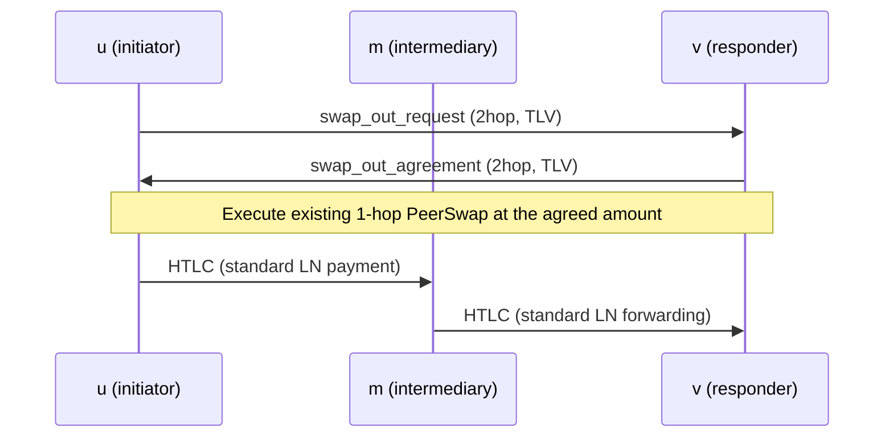
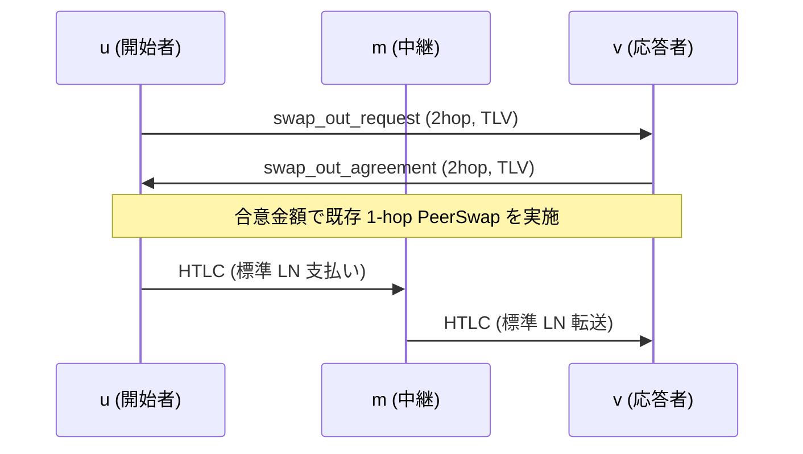

**Purpose**
Define a **minimal extension** that enables swaps over the common **2‑hop path `u → m → v`** while preserving the existing **1‑hop PeerSwap** protocol.

* The existing set of **1‑hop PeerSwap JSON messages remains unchanged**.
* Add a **discovery TLV** (i.e., an **optional `twohop` JSON container**) between **u–v** to **agree on an executable amount in 1 RTT**.

---

## 1. Motivation

PeerSwap enables **atomic exchange of on‑chain assets** between **two directly connected (1‑hop) nodes**. Real networks often feature **2‑hop paths** with exactly one intermediate node, **`u → m → v`**; we want swaps to be possible there as well.

* **Unlock liquidity without opening additional channels**
* **No cooperation or trust from the intermediate node `m` is required** (decisions rely only on **local information at the endpoints**)
* The **existing 1‑hop protocol at endpoints `u` and `v`** remains in use as‑is

This proposal **adds a discovery message (TLV)** for **u–v** to **agree on an executable amount in 1 RTT**, and keeps the **existing 1‑hop JSON messages** **unchanged** for the main flow thereafter.

---

## 2. Network Model

```
u──ch₁──m──ch₂──v
 ↕  p2p (tcp) ↕
```

* `ch₁`, `ch₂` are **public LN channels**.
* **`u` and `v` are already p2p‑connected** (custom BOLT#1 messages can be exchanged).
* Whether the intermediary **`m` supports PeerSwap does not matter**.

**Symbols**

* `u`: initiator
* `m`: intermediary
* `v`: responder

---

## 3. Overall Flow



* **u ↔ v** perform **2‑hop discovery (1 RTT amount agreement)**.
* After agreement, they proceed with the **existing 1‑hop PeerSwap JSON message set** (**unchanged**).
* Payments/forwarding use **standard LN (HTLC)** along `u → m → v`.

---

## 4. Wire Messages (Extensions to Existing JSON)

**Policy**

* **No new message types** are introduced.
* **Existing JSON messages** are extended with **optional additional fields**.
* **Meanings of existing fields do not change**.
* **All added fields are OPTIONAL**; unsupported nodes **MUST ignore** them.

**Target messages** (types unchanged):

* `swap_in_request` (JSON, **type=42069**)
* `swap_in_agreement` (JSON, **type=42073**)
* `swap_out_request` (JSON, **type=42071**)
* `swap_out_agreement` (JSON, **type=42075**)
* `opening_tx_broadcasted` and others: **no change**

> Below, each **message extension** is defined.
> **`twohop`** denotes the **2‑hop discovery mode** JSON container; if present, the receiver **interprets the message in 2‑hop mode**.

---

### 4.1 `swap_out_request` (JSON, type=42071) — Extension

**Additional field**

* `twohop`: object — container indicating 2‑hop discovery mode. If present, the receiver applies 2‑hop interpretation.

  * `twohop.intermediary_pubkey`: string (**33‑byte compressed pubkey, hex**) — pubkey of intermediary **`m`**

**Behavior**

* If `twohop` exists, **receiver `v`** identifies local **`ch₂` (m–v)** from `intermediary_pubkey`, computes its **own `receivable_msat`**, and checks whether the request is **within executable amount**.

**Compatibility**

* Nodes unaware of `twohop` ignore unknown fields and **safely reject** for reasons such as **`scid` not being a direct channel / `amount=0`**, per current rules.

---

### 4.2 `swap_out_agreement` (JSON, type=42075) — Extension

**Additional field** (all **optional**)

* `twohop`: object — result of 2‑hop discovery.

  * `twohop.incoming_scid`: string (e.g., `"x:y:z"`) — **short\_channel\_id** of **`ch₂` (m–v)**

**Behavior**

* If `twohop` exists, **receiver `u`** identifies local **`ch₁` (u–m)** from `intermediary_pubkey`, and **pays the `payreq` via the 2‑hop route using `incoming_scid`**.

**Notes**

* **Route hints are not used**. The **sender fixes the route** (supported by **standard LN APIs**).
* Route hints **cannot guarantee route pinning**.

---

### 4.3 `swap_in_request` (JSON, type=42069) — Extension

**Additional field**

* `twohop`: object — container indicating 2‑hop discovery mode. If present, the receiver applies 2‑hop interpretation.

  * `twohop.intermediary_pubkey`: string (**33‑byte compressed pubkey, hex**) — pubkey of intermediary **`m`**

**Behavior**

* If `twohop` exists, **receiver `v`** identifies local **`ch₂` (m–v)** from `intermediary_pubkey` and verifies whether the requested **`amount`** is **sendable**.

**Notes**

* In this 2‑hop extension, **`scid` specifies `ch₁` (u–m)**.
  Nodes without 2‑hop support ignore unknown fields; thus, cases like **`scid` not being a direct channel** are **safely rejected**.

**Compatibility**

* Nodes unaware of `twohop` ignore unknown fields and **reject under current validation** (`scid` / `amount`, etc.).

---

### 4.4 `swap_in_agreement` (JSON, type=42073) — Extension

**Additional field** (all **optional**)

* `twohop`: object — result of 2‑hop discovery.

  * `twohop.incoming_scid`: string (e.g., `"x:y:z"`) — **short\_channel\_id** of **`ch₂` (m–v)** (**from `v`’s perspective, m→v**)

**Behavior**

* If `twohop` exists, **responder `v`** confirms, at payment time, that the **receivable capacity on `incoming_scid`** **meets `amount`**.

---

## 5. Doing the Swap (Execution)

* If `twohop` exists, the **swap maker** identifies local **`ch₁` (u–m)** from `intermediary_pubkey` and **pays the `payreq` via the 2‑hop route using `incoming_scid`**.

> This aligns with **4.2 Behavior**. **Route hints are not used**.

---

## 6. `poll` Message Extension (Optional Proposal)

**Goal**
Have intermediary **`m`** **periodically broadcast** its **`connected_peers`** so that **`u` and `v`** can more easily **discover 2‑hop candidates**.

**Method**
Add an optional extension section **`neighbors_ad`** to the existing `poll` JSON.
Unsupported nodes can ignore unknown fields, preserving **backward compatibility**. Synchronizing send frequency/lifecycle with **`poll`** is sufficient in many cases.

* The interval is fixed; **freshness is not guaranteed**.
* There is **no mechanism to prevent false reports**; adoption is **optional**.
* At execution time, the **final amount is confirmed** by **2‑hop discovery (4.1)**.

**`poll` (JSON, type=42001) — Example Extension**

```json
{
  "version": 5,
  "assets": ["btc", "lbtc"],
  "peer_allowed": true,
  "btc_swap_in_premium_rate_ppm": 100,
  "btc_swap_out_premium_rate_ppm": 200,
  "lbtc_swap_in_premium_rate_ppm": 50,
  "lbtc_swap_out_premium_rate_ppm": 150,
  "neighbors_ad": {
    "v": 1,               // version of this section
    "public_only": true,  // advertise public channels only
    "limit": 20,          // upper bound for entries
    "entries": [
      {
        "node_id": "<pubkey-of-neighbor>",
        "channels": [
          {
            "channel_id": 1234567890,
            "short_channel_id": "x:y:z",
            "active": true
            // Optional (not sent by default):
            // "local_balance": 0,
            // "remote_balance": 0
          }
        ]
      }
    ]
  }
}
```

**Sending Policy**
From the node’s channel list, **extract public & active neighbors**.
By default, **do not send balance information** (privacy). With configuration, **approx/exact** can be **opt‑in**.
If exceeding `limit`, **down‑sample randomly or by score**.
**Triggers**: `poll` interval; response to `request_poll` right after startup.

**Receiver Behavior**
The receiver can present **2‑hop candidates including peers without a direct channel**.

**2hop nodes (conceptual example)**

```json
[
  {
    "nodeid": "<v_pubkey>",
    "intermediary_nodeid": "<m_pubkey>",
    "outgoing_scid": "<ch1 u–m>",
    "incoming_scid": "<ch2 m–v>",
    "spendable_msat": 0,
    "receivable_msat": 0,
    "sent": {
      "total_swaps_out": 2,
      "total_swaps_in": 1,
      "total_sats_swapped_out": 5300000,
      "total_sats_swapped_in": 302938
    },
    "received": {
      "total_swaps_out": 1,
      "total_swaps_in": 0,
      "total_sats_swapped_out": 2400000,
      "total_sats_swapped_in": 0
    },
    "total_fee_paid": 6082,
    "swap_in_premium_rate_ppm": 100,
    "swap_out_premium_rate_ppm": 100
  }
]
```

Actual swap execution can **transparently select from this list**, but **1‑hop should be preferred when all else is equal**.

---

## 7. Peer Discovery Strategies

With the `poll` extension, it becomes easier to **estimate 2‑hop swap feasibility and rough capacity**. Even without it, **direct probing** can discover candidates, albeit **less efficiently**.

| Strategy                                                         | Is `m` required to support PeerSwap? | Pros           | Cons                             |
| ---------------------------------------------------------------- | ------------------------------------ | -------------- | -------------------------------- |
| A – `poll` extension (periodic broadcast of `connected_peers`)   | yes                                  | Low latency    | Does not work if `m` unsupported |
| B – Direct probe (u p2p‑connects to v and sends a light message) | no                                   | Works anywhere | Adds two p2p connections         |

---

### Supplement (Clarification of Terminology)

* In this specification, **“discovery message (TLV)”** refers to the **optional `twohop` container within the JSON messages**.
* **Amount fields** (e.g., `amount`) **follow the existing specification** for units and semantics (**this proposal does not change their interpretation**).
* **Compatibility behavior** (ignoring unknown fields; rejection via existing checks like `scid`/`amount`) is **as in the current spec**; this document **merely makes it explicit** (it is **not a change**).


## 日本語

### 目的
既存の **1 ホップ PeerSwap** を保持したまま、実ネットで一般的な **2 ホップ経路 `u → m → v`** でもスワップを可能にする**最小拡張**を定義する。

* 既存の1ホップPeerSwapプロトコル（JSONメッセージ群）は**変更しない**
---

## 1. 動機

PeerSwapは**直結（1ホップ）の2ノード間**でオンチェーン資産をアトミックに交換できる。一方、実ネットワークには「間に1ノードだけ挟まる**2ホップ経路** `u → m → v`」が多数存在するため、ここでもスワップを可能にしたい。

* **追加チャネルを開かず**に流動性を解放
* **中継ノード m の協力や信頼は不要**（両端の**ローカル情報のみ**で判定）
* **端点 u・v 側の既存 1 ホップ・プロトコルはそのまま利用**

本提案では、**端点 u–v の間**で「**実行可能金額を 1RTT で合意**するための**発見メッセージ（TLV）**」を追加し、その後の本編（**既存の 1 ホップ JSON メッセージ群**）は**変更しない**。

---

## 2. ネットワークモデル

```
u──ch₁──m──ch₂──v
 ↕  p2p (tcp) ↕
```

* `ch₁`, `ch₂` は**公開 LN チャネル**
* **`u`と`v`はp2p接続済み**（BOLT#1のカスタムメッセージを送受信可）
* **中継 m が PeerSwap 対応かどうかは問わない**

**記号**

* `u`: 開始者（initiator）
* `m`: 中継（intermediary）
* `v`: 応答者（responder）

---

## 3. 全体フロー



* `u ↔ v` 間で\*\*2hop発見（1RTTでの実行可能金額の合意）\*\*を行う
* 合意後は、**既存の 1 ホップ PeerSwap の JSON メッセージ群**でスワップを進める（**変更なし**）
* 支払い/転送は **標準 LN（HTLC）** により `u → m → v` で行われる

---

## 4. ワイヤメッセージ（既存 JSON の拡張）

**方針**

* **新しいメッセージタイプは定義しない**
* **既存のJSONメッセージ**を、**オプショナルな追加フィールド**で拡張する
* **既存フィールドの意味は変更しない**
* **追加フィールドはすべて OPTIONAL**。未対応ノードは**無視**できる

**対象メッセージ**（typeは既存のまま）

* `swap_in_request`（JSON, **type=42069**）
* `swap_in_agreement`（JSON, **type=42073**）
* `swap_out_request`（JSON, **type=42071**）
* `swap_out_agreement`（JSON, **type=42075**）
* `opening_tx_broadcasted` ほかは**変更なし**

> 以下では、原案の記述順に従い**各メッセージの拡張**を定義する。
> **`twohop`** は**2ホップdiscoveryモード**を示すJSONコンテナであり、存在する場合のみ**2ホップとして解釈**する。

---

### 4.1 `swap_out_request`（JSON, type=42071）の拡張

**追加フィールド**

* `twohop`: object — 2ホップdiscoveryモードを示すコンテナ。存在すれば受信側は2ホップとして解釈する。

  * `twohop.intermediary_pubkey`: string（**33B圧縮pubkey, hex**）— 中継ノード**m**のpubkey

**動作**

* `twohop` が存在する場合、**受信者v** は `intermediary_pubkey` からローカルの**`ch₂`（m–v）**を特定する。**自身の`receivable_msat` を算出**し、**実行可能金額の範囲内かどうか**を判定する。

**互換性**

* `twohop` を理解しない旧ノードは未知フィールドを無視し、**`scid`が直接チャネルでない／`amount=0`等**の理由で**安全に拒否**される。

---

### 4.2 `swap_out_agreement`（JSON, type=42075）の拡張

**追加フィールド**（いずれも **optional**）

* `twohop`: object — 2ホップdiscoveryの応答結果。

  * `twohop.incoming_scid`: string（例: `"x:y:z"`）— **`ch₂`（m–v）** の **short\_channel\_id**

**動作**

* `twohop` が存在する場合、**受信者u** は `intermediary_pubkey` からローカルの**`ch₁`（u–m）**を特定する。
  **`incoming_scid` を経由する2ホップ経路で `payreq` へ支払う。**

**備考**

* **ルートヒントは使用しない**。**送信者が送金のrouteを固定**する（**LNの標準API**で対応可能）。
* ルートヒントは**routeを確実に固定できない**ため。

---

### 4.3 `swap_in_request`（JSON, type=42069）の拡張

**追加フィールド**

* `twohop`: object — 2ホップdiscoveryモードを示すコンテナ。存在すれば受信側は2ホップとして解釈する。

  * `twohop.intermediary_pubkey`: string（**33B圧縮pubkey, hex**）— 中継ノード**m**のpubkey

**動作**

* `twohop` が存在する場合、**受信者v** は `intermediary_pubkey` からローカルの**`ch₂`（m–v）**を特定し、要求された**`amount`**を**送信可能か**確認する。

補足。

* 本2ホップ拡張では、
  **`scid`は`ch₁`（u–m）のshort\_channel\_id**を指定する。
  2ホップ未対応ノードは未知フィールドを無視するため、
  **`scid`が直結チャネルでない**等の理由で**安全に拒否**される。

**互換性**

* `twohop` を理解しない旧ノードは未知フィールドを無視し、現行仕様どおりの検証（`scid`／`amount`等）で**拒否**される。

---

### 4.4 `swap_in_agreement`（JSON, type=42073）の拡張

**追加フィールド**（いずれも **optional**）

* `twohop`: object — 2ホップdiscoveryの応答結果。

  * `twohop.incoming_scid`: string（例: `"x:y:z"`）— **`ch₂`（m–v）**の**short\_channel\_id**（**v側から見たm→v**）

**動作**

* `twohop` が存在する場合、
  **応答者v** は支払い時に、**`incoming_scid` の受取可能額**を確認する。
  **`amount`**を満たす必要がある。

---

## 5. Doing the Swap（実行）

* `twohop` が存在する場合、**swap maker** は
  `intermediary_pubkey` からローカルの**`ch₁`（u–m）**を特定する。
  **`incoming_scid` を経由する2ホップ経路で `payreq` へ支払う。**

> ※上記は **4.2** の「動作」と整合する。**ルートヒントは使用しない**。

---

## 6. `poll` メッセージの拡張（任意提案）

**目的**
中継**m**が自ノードの**`connected_peers`**を**周期ブロードキャスト**する。
これにより、**`u`と`v`が2ホップ候補を発見しやすくなる**。

### 方式
既存`poll`のJSONに**`neighbors_ad`**拡張を追加する。
未対応ノードは未知フィールドを無視でき、**後方互換**が保てる。
送信頻度・ライフサイクルは**`poll` と同調**で十分なケースが多い。

* 周期は一定間隔であり、**最新性は保証しない**
* **虚偽報告を防ぐ手段はない**ため、採用は**オプショナル**
* スワップ実行時は**2ホップ発見（4.1）**で**金額を確定**する

**新規メッセージ `poll`（JSON, type=42001）の拡張例**

```json
{
  "version": 5,
  "assets": ["btc", "lbtc"],
  "peer_allowed": true,
  "btc_swap_in_premium_rate_ppm": 100,
  "btc_swap_out_premium_rate_ppm": 200,
  "lbtc_swap_in_premium_rate_ppm": 50,
  "lbtc_swap_out_premium_rate_ppm": 150,
  "neighbors_ad": {
    "v": 1,
    "public_only": true,
    "limit": 20,
    "entries": [
      {
        "node_id": "<pubkey-of-neighbor>",
        "channels": [
          {
            "channel_id": 1234567890,
            "short_channel_id": "x:y:z",
            "active": true
            // オプション（既定は非送信）:
            // "local_balance": 0,
            // "remote_balance": 0
          }
        ]
      }
    ]
  }
}
```

**送信ポリシー**
送信時にはLNノードのチャネル一覧から、**公開・activeな近傍を抽出**。
既定では**残高情報は送信しない**（プライバシー保護）。設定で**approx／exact**を**opt-in**可。
`limit` を超える場合は **ランダム／スコア順**で間引き。
**送信トリガ**: `poll` 周期・起動直後の `request_poll` 応答時。

**受信側の扱い**
受信者は、**直接チャネルを持たない相手も含めて**2ホップ候補を整形して提示できる。

**2hop nodes（概念例）**

```json
[
  {
    "nodeid": "<v_pubkey>",
    "intermediary_nodeid": "<m_pubkey>",
    "outgoing_scid": "<ch1 u–m>",
    "incoming_scid": "<ch2 m–v>",
    "spendable_msat": 0,
    "receivable_msat": 0,
    "sent": {
      "total_swaps_out": 2,
      "total_swaps_in": 1,
      "total_sats_swapped_out": 5300000,
      "total_sats_swapped_in": 302938
    },
    "received": {
      "total_swaps_out": 1,
      "total_swaps_in": 0,
      "total_sats_swapped_out": 2400000,
      "total_sats_swapped_in": 0
    },
    "total_fee_paid": 6082,
    "swap_in_premium_rate_ppm": 100,
    "swap_out_premium_rate_ppm": 100
  }
]
```

実際のスワップ実行は**透過的にこのリストから選択可能**ですが、**同等条件なら1ホップが優先**されるべきです。

---

## 7. ピア発見戦略

`poll` 拡張により、**2 ホップ swap 可能性や概算 capacity** を推測しやすくなる。これがなくとも**直接プローブ**により発見は可能だが、**能率は劣る**。

| 戦略                                                       | m が PeerSwap 必須か | 長所         | 短所                  |
| ---------------------------------------------------------- | -------------------- | ------------ | --------------------- |
| A – Poll 拡張（`connected_peers` 周期ブロードキャスト）    | yes                  | 低レイテンシ | m 非対応なら機能せず  |
| B – 直接プローブ（u が v と p2p 接続し軽量メッセージ送信） | no                   | どこでも動作 | p2p 接続が 2 回増える |

---

### 補足（読み替えの明確化）

* 本仕様でいう**「発見メッセージ（TLV）」**とは、\*\*JSONメッセージ内の`twohop`コンテナ（オプショナル拡張）\*\*を指す。
* **金額フィールド（例: `amount`）**の単位や意味は**既存仕様に従う**（本提案は**解釈を変更しない**）。
* **互換性**に関する挙動（未知フィールドの無視・既存検証による拒否等）は**原案どおり**であり、本稿はそれを**明示**しているだけである（仕様の**変更ではない**）。

---

以上。原案の**技術内容・要件・フロー・互換性の主張**は**そのまま維持**しています。文言のみ、**対象読者（高度なOSS開発者）に向けて曖昧さを排し**、参照・実装しやすい形に整えました。
