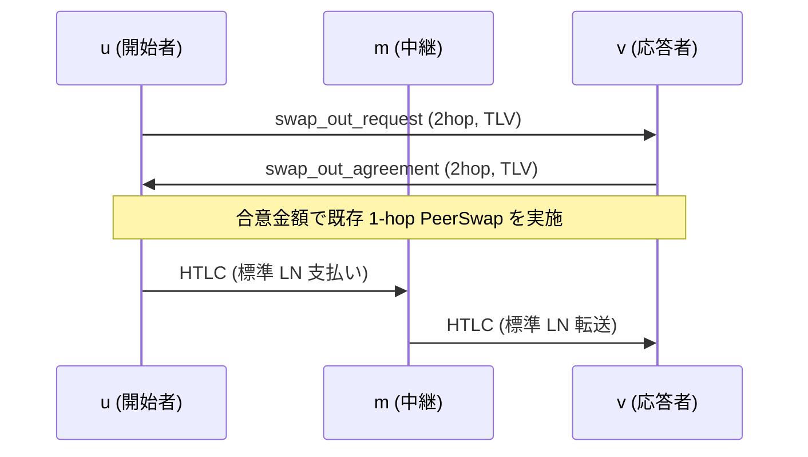

2hop peerswap の提案ドラフト。既存の 1 ホップ PeerSwap を維持したまま、実ネットで一般的な 2 ホップ経路 `u → m → v` でもスワップを可能にする最小拡張を示す。

## 1. 動機

PeerSwap は直結（1 ホップ）の 2 ノード間でオンチェーン資産をアトミックに交換できる。実ネットワークには「間に 1 ノードだけ挟まる 2 ホップ経路」 `u → m → v` が多数存在するため、ここでもスワップを可能にしたい。

- 追加チャネルを開かずに流動性を解放
- 中継ノード m の協力や信頼は不要（両端のローカル情報のみで判定）
- 端点 u・v 側の既存 1 ホップ・プロトコルはそのまま利用

本提案では、端点 u–v の間で「実行可能金額を 1RTT で合意するための発見メッセージ（TLV）」を追加し、その後の本編（既存の 1 ホップ JSON メッセージ群）は変更しない。

---

## 2. ネットワークモデル

```
u──ch₁──m──ch₂──v
 ↕  p2p (tcp) ↕
```

- `ch₁`, `ch₂` は公開 LN チャネル
- u と v は p2p 接続済み（BOLT#1 のカスタムメッセージを送受信可）
- 中継 m が PeerSwap 対応かどうかは問わない

---

## 3. 全体フロー



---

## 4. ワイヤメッセージ

本節は 2 ホップ用の「発見ハンドシェイク（TLV）」を定義する。以降の本編は既存の 1 ホップ JSON メッセージ（変更なし）に合流する。

### 4.1 2ホップ発見（TLV）

- メッセージタイプ（提案値。いずれも奇数）
  - swap_out_request (2hop, TLV): type = 54811
  - swap_out_agreement (2hop, TLV): type = 54813

#### swap_out_request (2hop, TLV)

u が自分の `u→m` 側送金可能量を提示し、v が自分の `v←m` 側受取可能量と付き合わせて実行可能金額を導出する。

```
// TLV スキーマ（単位は特記なき限り msat）
[1]  version:u64              ; 現状 1
[3]  swap_id:bytes            ; 16–32B ランダム
[5]  asset:bytes              ; "BTC" / Liquid の asset id 等（Liquid では network は空）
[7]  network:bytes            ; "mainnet" / "signet" / "regtest" …（BTC のみ）
[9]  scid:u64                 ; ch₁（u–m）の short_channel_id（数値）
[11] spendable:u64            ; u→m の送金可能量（msat）
[13] intermediary_key:bytes   ; m の圧縮 pubkey（33B）
[15] pubkey:bytes             ; u の圧縮 pubkey（33B）
```

受信者 v の要件:

- `intermediary_key` を先方とするローカルチャネル ch₂（m–v）を特定すること
- `receivable` = v←m の受取可能量を算出すること
- `amount_msat = min(spendable, receivable)` を計算すること
- `amount_msat` がローカル制約（チャネル容量や最大 HTLC 等）を超える場合は拒否

#### swap_out_agreement (2hop, TLV)

v が局所状態から導出した実行可能量を返答する。拒否時は `error` を設定。

```
// TLV スキーマ（単位は特記なき限り msat）
[1]  version:u64            ; 現状 1
[3]  swap_id:bytes          ; エコー
[5]  amount_msat:u64        ; min(spendable, receivable)（0 は非実行）
[7]  receivable:u64         ; v←m の受取可能量（診断用）
[9]  error:bytes            ; 任意 UTF-8 診断（非空なら拒否）
```

送信者 u は `error` が空で `amount_msat > 0` の場合、次節の既存 1 ホップ JSON メッセージでスワップを進める（`amount = amount_msat/1000` を用いる）。

> 備考: 2 ホップ発見はあくまで能力合意のみを扱い、手数料請求（`payreq`/`premium`）は既存 1 ホップの責務とする。

#### swap_in の対称性

swap-in 方向の 2 ホップ発見も上記と対称に定義できる（フィールド集合・意味論は同一で、役割のみ反転）。

### 4.2 既存 1 ホップ（JSON, 変更なし）

2 ホップ発見で合意した金額を用いて、現行の 1 ホップ PeerSwap をそのまま実行する（既存のメッセージ型・payload）。

- swap_out_request (JSON, type=42071): `amount` は sats 単位。`asset`/`network`/`scid`/`pubkey` 等は現行どおり
- swap_out_agreement (JSON, type=42075): `pubkey`, `payreq`（BOLT#11）, `premium`（任意）
- opening_tx_broadcasted (JSON, type=42077) ほか、既存シーケンスは不変

---

## 5. 実行時の送金経路

- ルートヒントは使用せず、送信者は送金の「発信チャネル（`ch₁`）」を固定する（LN の標準 API で対応可能）
- それ以外のホップは通常の LN ルーティングに委ねる

> 実装補足: 直接チャネルに対する送金は「発信チャネルの固定（OutgoingChanIds）」で強制できる。2 ホップ以上の「全ホップ固定」は標準実装では行わない。

---

## 6. poll メッセージの拡張（任意提案）

中継 m が自ノードの `connected_peers` を周期ブロードキャストすることで、u と v が 2 ホップ候補を発見しやすくする。

- 周期は一定間隔であり、最新性は保証しない
- 虚偽報告を防ぐ手段はないため、採用はオプショナル
- スワップ実行時には最終的に 2 ホップ発見（4.1）で実行可能金額を合意する前提

新規メッセージ案: `connected_peers`

```json
{
  "version": 5,
  "assets": ["btc", "lbtc"],
  "peer_allowed": true,
  "peers": [
    {
      "node_id": "<pubkey-of-neighbor>",
      "channels": [
        {
          "channel_id": 1234567890,
          "short_channel_id": "x:y:z",
          "local_balance": 0,
          "remote_balance": 0,
          "active": true
        }
      ]
    }
  ]
}
```

受信者は、直接チャネルを持たない相手も含めて 2 ホップ候補を整形して提示できる。

2hop nodes（概念例）

```json
[
  {
    "nodeid": "<v_pubkey>",
    "intermediary_nodeid": "<m_pubkey>",
    "outgoing_scid": "<ch1 u–m>",
    "incoming_scid": "<ch2 m–v>",
    "spendable_msat": 0,
    "receivable_msat": 0,
    "sent": {
      "total_swaps_out": 2,
      "total_swaps_in": 1,
      "total_sats_swapped_out": 5300000,
      "total_sats_swapped_in": 302938
    },
    "received": {
      "total_swaps_out": 1,
      "total_swaps_in": 0,
      "total_sats_swapped_out": 2400000,
      "total_sats_swapped_in": 0
    },
    "total_fee_paid": 6082,
    "swap_in_premium_rate_ppm": 100,
    "swap_out_premium_rate_ppm": 100
  }
]
```

実際のスワップ実行は透過的にこのリストから選択可能だが、同等条件なら 1 ホップが優先されるべきである。

---

## 7. ピア発見戦略

poll 拡張により、2 ホップ swap 可能性や概算 capacity を推測しやすくなる。これがなくとも直接プローブにより発見は可能だが、能率は劣る。

| 戦略                                                       | m が PeerSwap 必須? | 長所         | 短所                  |
| ---------------------------------------------------------- | ------------------- | ------------ | --------------------- |
| A – Poll 拡張（`connected_peers` 周期ブロードキャスト）    | yes                 | 低レイテンシ | m 非対応なら機能せず  |
| B – 直接プローブ（u が v と p2p 接続し軽量メッセージ送信） | no                  | どこでも動作 | p2p 接続が 2 回増える |

---

本ドラフトは、実装改変を最小化するため「2 ホップは発見のみを TLV で追加し、実行は既存 1 ホップ JSON に合流する」方針を取る。これにより後方互換性を保ちつつ、2 ホップ経路の流動性を活用できる。

